# TOC

- 데이터 파이프라인
  - 서버 환경 설정
    - [Python](#python)
    - [JupyterHub](#jupyterhub)
        - [Jupyterhub 설치](#jupyterhub-설치)
        - [Jupyterhub 가상환경 추가](#jupyterhub-가상환경-추가-및-anaconda-패키지-설치)
        - [Jupyterhub 가상환경 추가 (GPU)](#jupyterhub-가상환경-추가-gpu)
    - [Docker](#docker)
      - [Docker Image](#docker-image)
      - [Docker-Compose](#docker-compose)
      - [Docker 설치](#docker-설치)
      - [Docker Container GPU 적용](#docker-container-gpu-적용)
      - [Docker-compose 설치](#docker-compose-설치)
      - [Docker-Daemon 설정](#docker-daemon-설정)
      - [Docker 기본 명령어](#docker-기본-명령어)
    - [Airflow](#airflow)
      - [Airflow 동작원리](#airflow-동작원리)
      - [Airflow DAG](#airflow-dag)
      - [Airflow task flow 예제](#airflow-task-flow-예제)
      - [Airflow Operator](#airflow-operator)
      - [Airflow Worker 분리](#airflow-worker-분리) 
      - [Docker URL(DockerOperator 사용)](#docker-urldockeroperator-사용)
      - [Docker URL 세팅](#docker-url-세팅)
      - [분석서버 Worker(PythonOperator 사용)](#분석서버-workerpythonoperator-사용)
      - [분석서버 worker 세팅](#분석서버-worker-세팅)
    - [MLFlow](#mlflow)
      - [MLFlow 설치 및 실행](#mlflow-설치-및-실행)
    - [Kafka](#kafka)
      - [Kafka 설치 및 connector생성](#kafka-설치-및-connector생성)
    - [Git](#git)
      - [Gitalb - Runner](#gitlab-runner)
        - [Gitlab - Runner 설치](#gitlab-runner-설치)
        - [Gitlab - Runner 세팅1(CD)](#gitlab-runner-세팅1cd)
        - [Gitalb - Runner 세팅2(private project인 경우만 진행)](#gitlab-runner-세팅2private-project인-경우만-진행)
      - [Gitlab-ci](#gitlab-ci)  
        - [Gitlab-ci.yml 작성](#gitlab-ciyml-작성)
        - [CI/CD 파이프라인 확인](#cicd-파이프라인-확인)
  - [개발 환경 설정](#개발-환경-설정)
    - [WSL2](#wsl2)
      - [WSL2란?](#wsl2란)
      - [고려사항](#고려사항)
      - [WSL1 vs WSL2](#wsl1-vs-wsl2)
      - [WSL2 설치](#wsl2-설치)
      - [WSL2로 변환](#wsl2로-변환)
      - [Docker 수동설치](#docker-수동설치)
        - [Install](#install)
    - 개발툴 설치
      - [VSCode](#vscode)
        - 추천 VSCode Extension
    - [Git 연결](#git-연결)
    - [Airflow 로컬 설치](#airflow-로컬-설치)
      - [Airflow와 docker-compose.yaml](#airflow와-docker-composeyaml)
      - [docker-compose.yaml 파일 설명](#docker-composeyaml-파일-설명)
      - [Airflow 실행](#airflow-실행)
  - **[개발 가이드](#개발-가이드)**
    - [개요 및 아키텍처](#개요-및-아키텍쳐)
    - [패키지 구조](#패키지-구조)
      - [Data](#data)
        - [Webex 알림 설정](#Webex-알림-설정)
        - [Airflow 모듈 추가](#airflow-모듈-추가)
      - [Preps](#preps)
      - [Xfroms](#xforms)
      - [Models](#models)
      - [pipelines](#pipelines)
        - [PythonOperator vs DockerOperator](#pythonoperator-vs-dockeroperator)
        - [PythonOperator 작성법](#pythonoperator-작성법)
        - [DockerOperator 작성법](#dockeroperator-작성법)
        - [MLFlow 사용 방법](#mlflow-사용-방법)
        - [yaml 파일 작성](#yaml-파일-작성)
        - [DAG File 샘플 작성](#dag-file-샘플-작성)
        - [DAG TAG 규칙](#dag-tag-규칙)
        - [현재 완료된 DAG 설명](#현재-완료된-dag-설명)
      - [common](#common)
    - [빌드](#빌드)
    - [배포 및 테스트](#배포-및-테스트)
    - [발생 가능 에러](#발생-가능-에러)


# 데이터 파이프라인

# Airflow WorkFlow

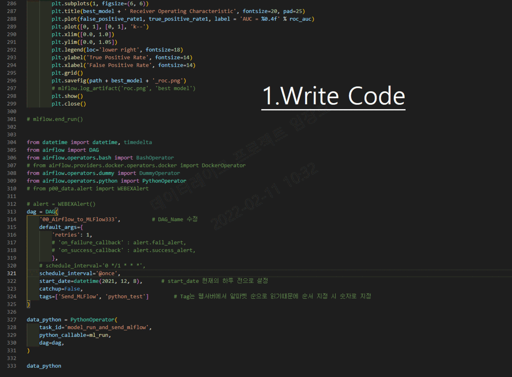

# 서버 환경 설정

## Python 

> Airflow를 사용하기 위한 최소 Python version은 3.6이상이다.  
> 서버에 설치한 Airflow는 Python 3.8 Version을 사용한다.

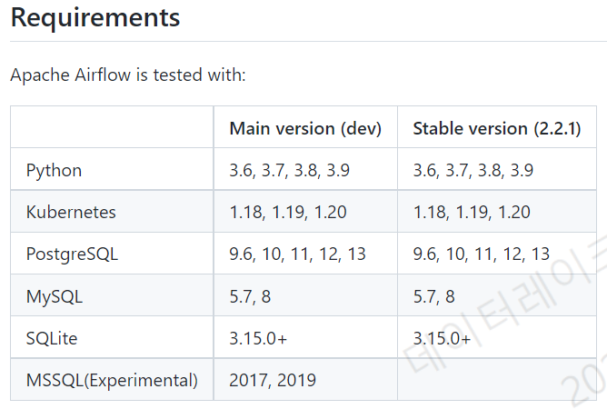

**<br><span style='color:gray; float: right;'>[TOC ↑](#)</span><br>**

---

## Jupyterhub

> 개인별 계정관리와 Python 파일 관리가 가능하며 계정별 로그인 및 자기만의 Jupyterhub Notebook 환경을 제공한다.   

**<br><span style='color:gray; float: right;'>[TOC ↑](#)</span><br>**

### Jupyterhub 설치

    # Docker를 이용하여 Jupyterhub를 구축

    1. git clone 
    git clone https://github.com/jupyterhub/the-littlest-jupyterhub.git
    
    2. Docker image build
    docker build -t tljh-systemd . -f integration-tests/Dockerfile
    
    3. Docker 실행 Shell 작성
    cat > start-tljh.sh
    sudo docker run --privileged --detach --name=tljh-dev -v $(pwd):/srv/src -v ${pwd}/home:/home --net=host tljh-systemd
    
    4. Docker 컨테이너 접속
    docker exec -it tljh-dev /bin/bash
    
    5. 서비스 실행
    # In Docker Container
    python3 /srv/src/the-littlest-jupyterhub/bootstrap/bootstrap.py --admin <ID:PW>
    
    # docker network host이므로 18010포트로 http접속을 할 수 있도록 설정 후 reload
    # In  Docker Container
    6. tljh-config set http.port 18010 / 
       tljh-config set https.port 19010 / 
       tljh-config reload proxy
    
    6-1. Login한 유저의 기본 Interface lab으로 변경
    sudo tljh-config set user_environment.default_app jupyterlab
    sudo tljh-config reload hub
    
    6-2. tljh가 유휴 컬링 서비스(동작이 없을 시 Server down)는 기본적으로 활성화되어있기에(Default = 10min) 비활성화 옵션 추가
    sudo tljh-config set services.cull.enabled False
    sudo tljh-config reload
    
    7. 접속확인
    http://10.120.4.106:18010/


**<br><span style='color:gray; float: right;'>[TOC ↑](#)</span><br>**


### Jupyterhub 가상환경 추가 및 anaconda 패키지 설치

    0. JupyterLab 환경으로 변경
    URL의 tree를 lab으로 변경
    
    1. Terminal접속
        좌측 New 클릭 -> Terminal 클릭 
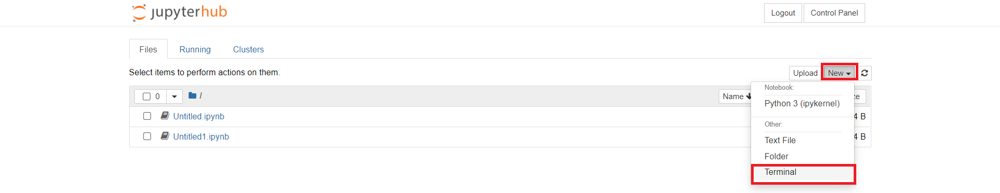

    2. 가상환경 생성
    conda create -n <name> python=3.8
    # 가상환경 생성 확인
    conda env list
    
    3. 가상환경 접속 
    conda init
    # Terminal 재접속 후
    conda activate <name>conda
    
    4. anaconda 패키지 설치
    # conda install -c <channel> <Package>    anaconda 채널 / 패키지 검색 : anaconda.org
    conda install -c main anaconda 
    # 만약 안될시
    conda install -c anaconda anaconda
    
    5. imblearn, lightgbm 설치
    pip install imblearn
    conda install lightgbm
    
    6. 커널추가
    커널을 추가할 가상환경에서 진행 
    pip install ipykernel
    
    python -m ipykernel install --user --name [virtualEnv] --display-name "[displayKenrelName]"


**<br><span style='color:gray; float: right;'>[TOC ↑](#)</span><br>**

### Jupyterhub 가상환경 추가 (GPU)

    # Tensorflow GPU를 사용하려면 선행으로 nvidia-container-toolkit 설치가 진행되어야 함
    # [Docker Container GPU 적용] 항목 참조
    
    # 1. 가상환경 생성
    $ conda create -n <가상환경 이름> python=3.8
    
    # 2. 가상환경 접속
    $ conda init 
    $ conda activate <가상환경 이름>
    
    3. conda package 설치
    $ conda install -y -c conda-forge tensorflow-gpu beautifulsoup4 sasl matplotlib seaborn tqdm thrift scikit-learn pytz pyhive pymysql pyarrow cyrus-sasl lightgbm catboost xgboost shap pycaret lime tslearn statsmodels pmdarima pyyaml psycopg2 jaydebeapi pyspark
    
    4. conda package에 없는 라이브러리 pip로 설치 진행
    $ pip install pyhdfs hdfs hdbcli imblearn pyjdbc

**<br><span style='color:gray; float: right;'>[TOC ↑](#)</span><br>**

---

## Docker   

> "Docker"는 Linux 컨테이너를 만들고 사용할 수 있도록 하는 컨테이너화 기술이다.    
>
> Docker를 사용하면 컨테이너를 매우 가벼운 모듈식 가상 머신처럼 다룰 수 있다. 또한 컨테이너를 구축, 배포, 복사하고 한 환경에서 다른 환경으로 이동하는 등 유연하게 사용할 수 있어, 애플리케이션을 클라우드에 최적화하도록 지원한다.  
>
> Docker Container의 이점  
> - 모듈성  
> - 계층 및 이미지 버전 제어  
> - 롤백  
> - 신속한 배포  
>
> 출처: https://www.redhat.com/ko/topics/containers/what-is-docker  

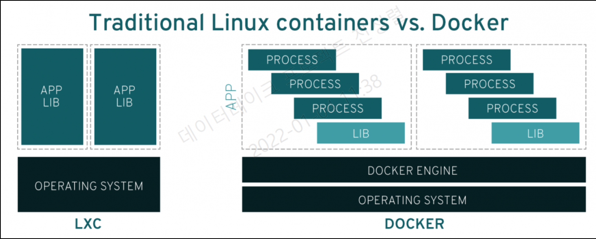

**<br><span style='color:gray; float: right;'>[TOC ↑](#)</span><br>**

## Docker Image 

> 이미지는 컨테이너 실행에 필요한 파일과 설정값등을 포함하고 있는 것으로 상태값을 가지지 않고 변하지 않는다(Immutable). 컨테이너는 이미지를 실행한 상태라고 볼 수 있고 추가되거나 변하는 값은 컨테이너에 저장된다. 같은 이미지에서 여러개의 컨테이너를 생성할 수 있고 컨테이너의 상태가 바뀌거나 컨테이너가 삭제되더라도 이미지는 변하지 않고 그대로 남아있다.
>
> Docker Layer란?도커 이미지는 컨테이너를 실행하기 위한 모든 정보를 가지고 있기 때문에 보통 용량이 수백메가MB에 이른다. 처음 이미지를 다운받을 땐 크게 부담이 안되지만 기존 이미지에 파일 하나 추가했다고 수백메가를 다시 다운받는다면 매우 비효율적일 수 밖에 없다.
>
> 도커는 이런 문제를 해결하기 위해 레이어layer라는 개념을 사용하고 유니온 파일 시스템을 이용하여 여러개의 레이어를 하나의 파일시스템으로 사용할 수 있게 해준다. 이미지는 여러개의 읽기 전용 read only 레이어로 구성되고 파일이 추가되거나 수정되면 새로운 레이어가 생성된다. ubuntu 이미지가 A + B + C의 집합이라면, ubuntu 이미지를 베이스로 만든 nginx 이미지는 A + B + C + nginx가 된다. webapp 이미지를 nginx 이미지 기반으로 만들었다면 예상대로 A + B + C + nginx + source 레이어로 구성된다. webapp 소스를 수정하면 A, B, C, nginx 레이어를 제외한 새로운 source(v2) 레이어만 다운받으면 되기 때문에 굉장히 효율적으로 이미지를 관리할 수 있다.
>
> 컨테이너를 생성할 때도 레이어 방식을 사용하는데 기존의 이미지 레이어 위에 읽기/쓰기read-write 레이어를 추가한다. 이미지 레이어를 그대로 사용하면서 컨테이너가 실행중에 생성하는 파일이나 변경된 내용은 읽기/쓰기 레이어에 저장되므로 여러개의 컨테이너를 생성해도 최소한의 용량만 사용한다.
>
> 출처: https://cultivo-hy.github.io/docker/image/usage/2019/03/14/Docker%EC%A0%95%EB%A6%AC/

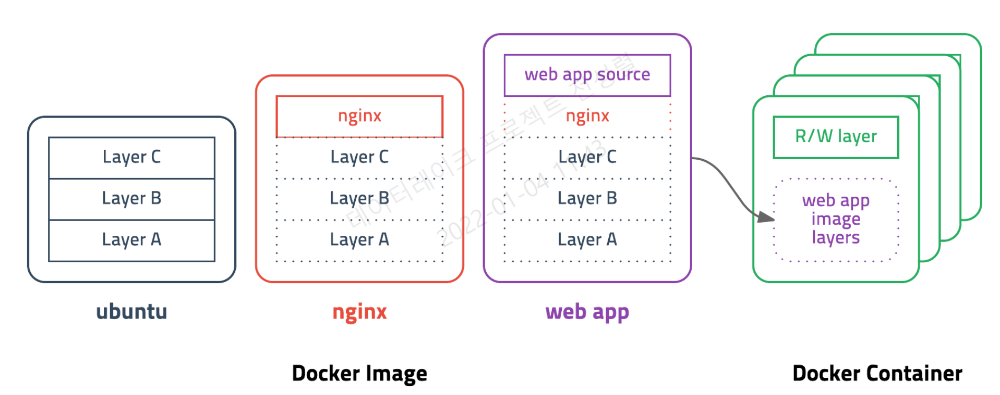

**<br><span style='color:gray; float: right;'>[TOC ↑](#)</span><br>**

## Docker-compose 

> 여러 개의 컨테이너로부터 이루어진 서비스를 구축, 실행하는 순서를 자동으로 하여, 관리를 간단히하는 기능이다.
>
> Docker compose에서는 compose 파일을 준비하여 커맨드를 1회 실행하는 것으로, 그 파일로부터 설정을 읽어들여 모든 컨테이너 서비스를 실행시키는 것이 가능하다.
>
> 출처: https://engineer-mole.tistory.com/221

**<br><span style='color:gray; float: right;'>[TOC ↑](#)</span><br>**


## Docker 설치

    # Docker Version 20.10.12
    # root 계정이 아닐 경우 sudo 사용
    1. CentOS 업데이트
    sudo yum update
    
    2. Docker Update에 필요한 Tool 설치
    sudo yum install -y yum-utils device-mapper-persistent-data lvm2
    
    3. Docker 공식 Repository 추가
    sudo yum-config-manager --add-repo https://download.docker.com/linux/centos/docker-ce.repo
    
    4. 설치가능한 Docker version 확인
    sudo yum list docker-ce --showduplicates | sort -r
    
    5. 최신 Docker version 설치
    sudo yum install -y docker-ce
    
    6. Docker 시작
    systemctl start docker
    
    7. Docker 상태 확인
    systemctl status docker

**<br><span style='color:gray; float: right;'>[TOC ↑](#)</span><br>**

## Docker Container GPU 적용

    docker GPU 셋팅을 위한 nvidia-container-toolkit 설치

    # 그래픽카드 Spec에 맞는 드라이버 설치
    $ distribution=$(. /etc/os-release;echo $ID$VERSION_ID)
    $ curl -s -L https://nvidia.github.io/nvidia-docker/$distribution/nvidia-docker.repo | sudo tee /etc/yum.repos.d/nvidia-docker.repo
    $ yum install nvidia-container-toolkit
    
    # 도커 시스템 재시작
    $ systemctl restart docker
    
    # GPU Check
    $ docker run -it --rm --gpus all ubuntu nvidia-smi
    
    ### Dockerfile / docker-compose 파일 수정
    
    # Airflow compose file deploy 속성 추가 (worker / server)
    
    deploy:
      resources:
        reservations:
          devices:
            - driver: nvidia
              count: all
              capabilities: [gpu]
    
    jupyterhub shell script --gpus all 속성 추가
    
    ### 22.05.20 기준 107번 서버만 적용됨

**<br><span style='color:gray; float: right;'>[TOC ↑](#)</span><br>**


## Docker-compose 설치

    # Docker-compose Version 1.25.5
    1. docker-compose 파일 설치
    sudo curl -L "https://github.com/docker/compose/releases/download/1.29.2/docker-compose-$(uname -s)-$(uname -m)" -o /usr/local/bin/docker-compose
    
    2. docker-compose 파일 실행 권한 부여
    sudo chmod +x /usr/local/bin/docker-compose
    
    #docker-compose의 링크가 생성되지 않아 docker-compose가 실행되지 않을때 아래와 같이 링크를 만들어 줌 
    sudo ln -s /usr/local/bin/docker-compose /usr/bin/docker-compose
    
    3. docker-compose 확인 
    docker-compose --version

**<br><span style='color:gray; float: right;'>[TOC ↑](#)</span><br>**

## Docker-Daemon 설정

    내부망 사용 시 네트워크의 DNS접미사가 붙어야 할 때 하는 설정!

    1. Docker 설정 변경을 위해 Docker stop
    systemctl stop docker docker.socket
    
    2. DNS 설정을 위해 daemon.json 생성 혹은 수정
    vi /etc/docker/daemon.json
    
    3. daemon.json 내용 추가
    {
        "dns": ["10.120.1.24", "10.120.1.25"],
        "dns-search": ["lottechilsung.co.kr"]
    }


    3.1 Docker의 Data 저장소 변경 시 기존 데이터 복사
    sudo rsync -aP /var/lib/docker/ /path/to/your/docker
    3.1 Docker의 Data 저장소 변경 시 daemon.json 옵션 추가
        "data-root": "path/to/your/docker"
    
    4. docker 재시작
    systemctl start docker

**<br><span style='color:gray; float: right;'>[TOC ↑](#)</span><br>**


## Docker 기본 명령어

    # 실행중인 컨테이너 확인
    docker ps
    
    # Docker version 확인
    docker version
    
    # docker 도움말 확인
    docker --help
    
    # docker 원격 저장소(dockerhub)에서 이미지를 가져온다
    ## docker와 dockerhub는 다르다! ≒ git / github
    docker pull [image name]
    ex) docker pull hello-world
    
    # docker image 리스트 확인
    docker images
    
    # docker 컨테이너 등록과 실행
    ## run은 기본적으로 pull을 포함하여 실행한다.
    docker run [image name]
    
    # 컨테이너 삭제
    docker rm [container id | container name]
    
    # 이미지 삭제
    docker rmi [image name]
    
    # 컨테이너 실행
    docker start [container name]
    
    # 컨테이너 중지
    docker stop [container name]
    
    # 컨테이너 내부로 진입
    docker exec -it [container name] /bin/bash

##### 출처: http://junil-hwang.com/blog/docker-theorem/


**<br><span style='color:gray; float: right;'>[TOC ↑](#)</span><br>**

---
## Airflow 

> Python 코드로 워크플로우(workflow)를 작성하고, 스케쥴링, 모니터링 하는 플랫폼이다.   
>
> Airflow를 통해서 데이터엔지니어링의 ETL 작업을 자동화하고, DAG(Directed Acyclic Graph) 형태의 워크플로우 작성이 가능하다.   
>
> 이를 통해 더 정교한 dependency를 가진 파이프라인을 설정할 수 있다. 또한 AWS, GCP 모두 Airflow managed service를 제공할 정도로 전세계 데이터팀들에게 널리 사용되고 있으며 그만큼 넓은 커뮤니티를 형성하고 있다.


> **Airflow에 pip 모듈 추가 방법**
>
> 1. airflow-server/requirements.txt에 모듈 추가
> 2. Airflow 서비스 Down  
>   2-1. docker-compose -f 'docker-compose_landing.yaml' down
> 3. 모듈을 airflow image에 설치하기 위해 build 진행  
>   3-1. docker build . -t 'airflow_server'
> 4. Airflow 재시작  
>   4-1. docker-compose -f 'docker-compose_landing.yaml' up


**<br><span style='color:gray; float: right;'>[TOC ↑](#)</span><br>**

## Airflow 동작원리

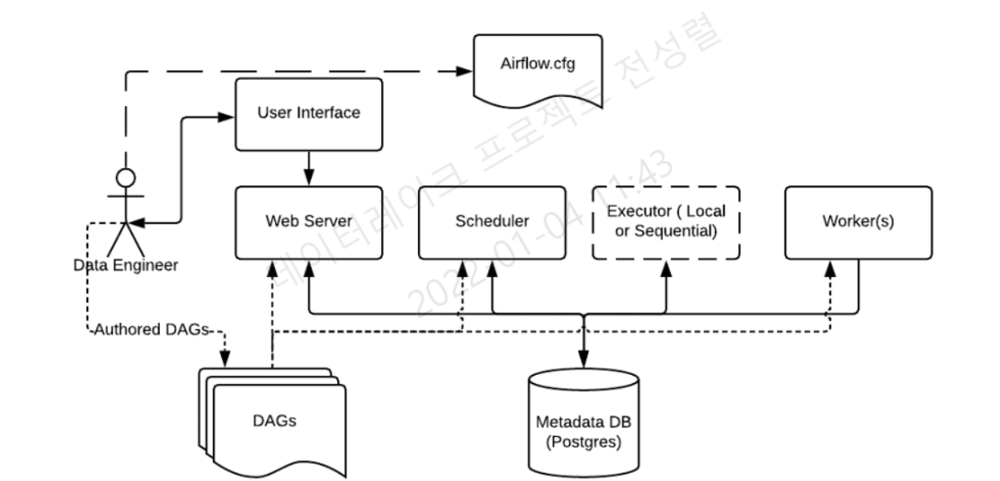

> - Scheduler : 모든 DAG와 Task에 대하여 모니터링 및 관리하고, 실행해야할 Task를 스케줄링 해준다.  
> - Web server : Airflow의 웹 UI 서버  
> - DAG : Directed Acyclic Graph로 개발자가 Python으로 작성한 워크플로우 / Task들의 dependency를 정의한다.  
> - Database : Airflow에 존재하는 DAG와 Task들의 메타데이터를 저장하는 데이터베이스  
> - Worker  : 실제 Task를 실행하는 주체 / Executor 종류에 따라 동작 방식이 다양하다.  

**<br><span style='color:gray; float: right;'>[TOC ↑](#)</span><br>**

## Airflow DAG

> Airflow의 DAG는 실행하고 싶은 Task들의 관계와 dependency를 표현하고 있는 Task들의 모음이다.     
> 어떤 순서와 어떤 dependency로 실행할지, 어떤 스케줄로 실행할지 등의 정보를 가지고 있다.    
> 따라서 DAG를 정확하게 설정해야, Task를 원하는 대로 스케쥴링할 수 있다.

**<br><span style='color:gray; float: right;'>[TOC ↑](#)</span><br>**

## Airflow task flow 예제

> DAG파일에서는 Task의 진행순서를 지정할 수 있습니다. 
> 1. 직렬실행
>   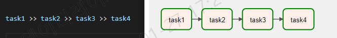
>
> 2. 병렬실행   
>   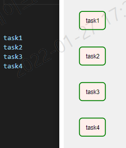   
>   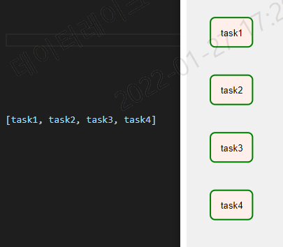 
>
> 3. 그룹실행   
>   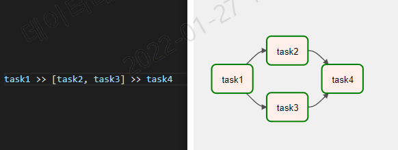
>
> 활용예제
> 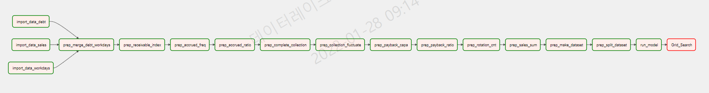

## Airflow Operator

> 각 Airflow DAG는 여러 Task로 이루어져있다. operator나 sensor가 하나의 Task로 만들어진다. Airflow는 기본적인 Task를 위해 다양한 operator를 제공한다.
>
> BashOperator : bash command를 실행    
> PythonOperator : Python 함수를 실행   
> EmailOperator : Email을 발송   
> MySqlOperator : sql 쿼리를 수행   
> Sensor : 시간, 파일, db row, 등등을 기다리는 센서   
> DockerOperator : Dockerimage를 컨테이너로 실행   
>
> Airflow에서 기본으로 제공하는 operator 외에도 커뮤니티에서 만든 수많은 operator들이 Data Engineer의 작업을 편하게 만들어 주고 있다.  
> 출처:https://www.bucketplace.co.kr/post/2021-04-13-%EB%B2%84%ED%82%B7%ED%94%8C%EB%A0%88%EC%9D%B4%EC%8A%A4-airflow-%EB%8F%84%EC%9E%85%EA%B8%B0/

**<br><span style='color:gray; float: right;'>[TOC ↑](#)</span><br>**


## Airflow Worker 분리

> 단일 노드로 구축을 하게 되면 리소스가 부족할 수 있다.  
> 성능이 좋지 않은 랜딩서버에서는 Airflow를 실행만 하고 실질적인 Task수행은 분석서버에서 진행하여 효율적인 리소스 분배를 할 수 있도록 하는 작업이다.  
> 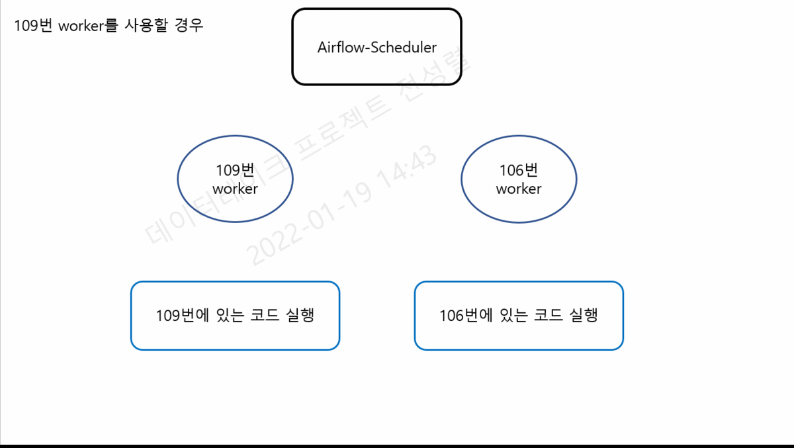

**<br><span style='color:gray; float: right;'>[TOC ↑](#)</span><br>**

## Docker URL(DockerOperator 사용)

> DockerOperator의 경우 docker_url, image, command 등을 파라미터로 받아서 어떤 Docker에서 어떤 이미지를 불러와 컨테이너를 생성하고 그 컨테이너 안에서 어떤 명령을 수행해야 하는지 지정해준다. 그렇기 때문에 Worker를 따로 설치해주지 않고 분석서버의 docker_url을 지정하여 사용한다. 
>
> 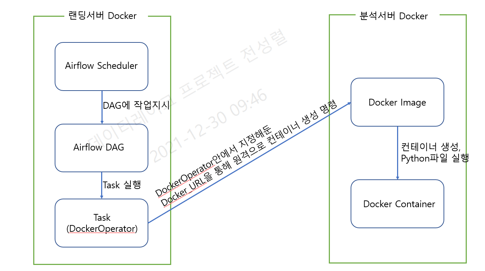

**<br><span style='color:gray; float: right;'>[TOC ↑](#)</span><br>**

## Docker URL 세팅

    #분석서버에 Docker가 설치되어 있다고 가정
    1. docker daemon.json에서 hosts옵션 설정 시 데몬 실행이 안되어서 2375포트를 열어두는 이미지 실행
    docker run -p 2375:2375 -v /var/run/docker.sock:/var/run/docker.sock jarkt/docker-remote-api
    
    ps) Windows-Docker Desktop 에서 Docker Engine에서 hosts설정시 적용이 되었지만 Linux에서 daemon.json에 hosts옵션을 추가해주었더니 Docker Engine이 실행이 되지않는 에러가 발생! DockerOperator에서 docker url의 경우 2375 포트를 사용하여 통신하기에 특정 포트를 여는 이미지를 사용하여 2375번 포트를 열어 해결
    
    2. 랜딩서버에 있는 DAG-DockerOperator에 분석서버 docker_url 지정
    docker_url = 'tcp://10.120.4.106:2375'

**<br><span style='color:gray; float: right;'>[TOC ↑](#)</span><br>**


## 분석서버 Worker(PythonOperator 사용)

> PythonOperator를 사용할 때 충분한 리소스를 가진 분석서버에서 Woker를 따로 설치하고 Worker의 이름인 queue이름을 지정하여 지정된 queue을 가진 Worker가 작업을 수행하게 할 수 있다. DAG파일에서 Queue옵션을 통해 수행할 Worker를 설정하여 여러 Worker를 사용할수 있다.
>
> 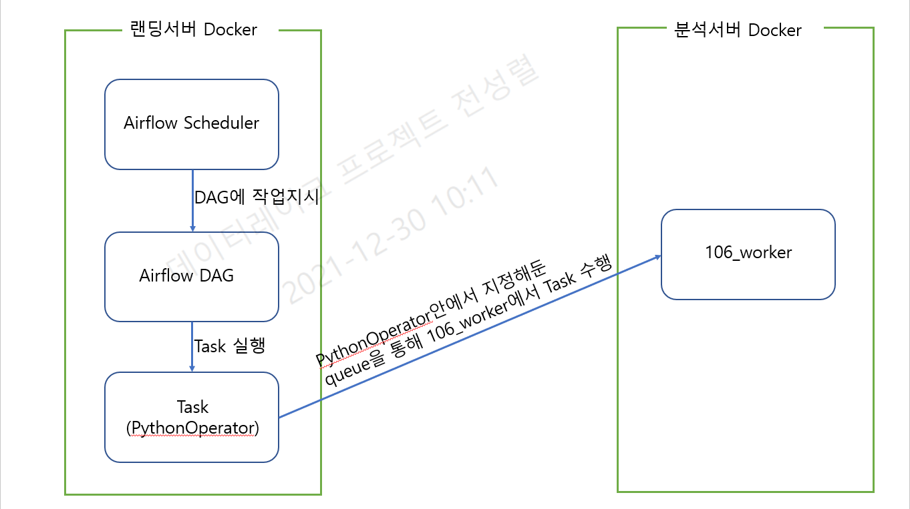

**<br><span style='color:gray; float: right;'>[TOC ↑](#)</span><br>**


## 분석서버 Worker 세팅

    1. Airflow와 필요 모듈을 설치하는 Dockerfile 작성 후 이미지 Build
    docker build <Dockerfile/path/> -t "<Image Name>"
    
    2. 1번에서 만든 이미지를 기반으로 Airflow-worker compose 파일 작성
    -----------------------------------------------------
    중요 옵선
     - image: ${AIRFLOW_IMAGE_NAME:-<Image Name>}
     - command: celery worker -q "<worker_name>"
     - hostname: ${HOSTNAME}
     - ports: 8793:8793         # webserver가 worker의 log를 읽을 때 8793 포트를 사용 (default | 변경은 가능)
     - environment:
      - CORE_SQL_ALCHEMY_CONN: <Airflow Server가 있는 IP 및 RDB conn>
      - CELERY_RESULT_BACKEND: <Airflow Server가 있는 IP 및 RDB conn>
      - CELERY_BROKER_URL: <Airflow Server가 있는 IP 및 Redis conn>
      - WEBSERVER_SECRET_KEY: <Random값>        # Airflow Server와 같은 값을 가지고 있어야 log를 확인할 수 있다. 다를 경우 CSRF 에러 발생
     - volumes:
      - logs:/opt/airflow/logs  # logs 폴더 볼륨으로 지정해 로컬에 남게 해주어야 컨테이너가 사라져도 logs 파일이 로컬에 남아있다
      - dags:/opt/airflow/dags  # 실행할 파일을 넣어주어야 scheduler / trigger를 통해 실행 명령이 오면 실행할 수 있다 (CI/CD를 통해 자동화)
     - privileged: true    # 도커는 Default로 Unprivileged 모드로 실행되어 시스템 주요 자원에 접근할 권한이 부족하기 때문에 네트워크 / 디렉토리 접근을 위해 privileged 옵션을 부여
    
    Worker설치를 진행할 유저가 수정할 docker-compose 파일의 옵션은 주로 위의 옵션들 / 그 외 필요한 부분이나 추가할 옵션등은 Airflow 공식 레퍼런스를 참고 바람 
    
    ----------------------------------------------------
    3. docker-compose 파일 작성 완료 후 docker-compose 실행
    # docker-compose file이 있는 디렉토리로 이동 후
    docker-compose up
    
    4. 정상 작동 확인
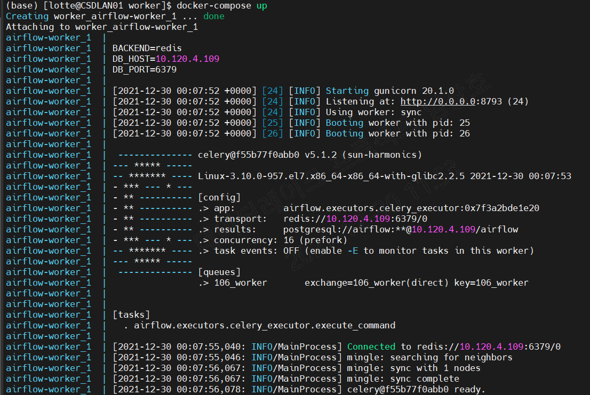

### Airflow Reference : [Airflow Configuration Reference](https://airflow.apache.org/docs/apache-airflow/stable/configurations-ref.html)

**<br><span style='color:gray; float: right;'>[TOC ↑](#)</span><br>**

---
# MLFlow

> MLFlow는 머신러닝 모델의 LifeCycle을 관리해주는 오픈소스 툴이다.  
> 모델의 학습을 기록 / 환경 관리 / 배포 지원 / 다양한 버전의 모델을 관리할 수 있도록 도움을 준다  
> 다른 MLOps 툴에 비해 확장성과 커버리지 면에서 우수하다.  
>
> ※ 단 Airflow 2.2.3 기준으로 Airflow기반에서 MLFlow는 MLFlow 1.7.0 버전을 지원한다.  
> 1.22.0 버전을 사용하려면 Docker로 올린 MLFlow 컨테이너 내에서 실행을 해야한다.

**<br><span style='color:gray; float: right;'>[TOC ↑](#)</span><br>**

## MLFlow 설치 및 실행

> 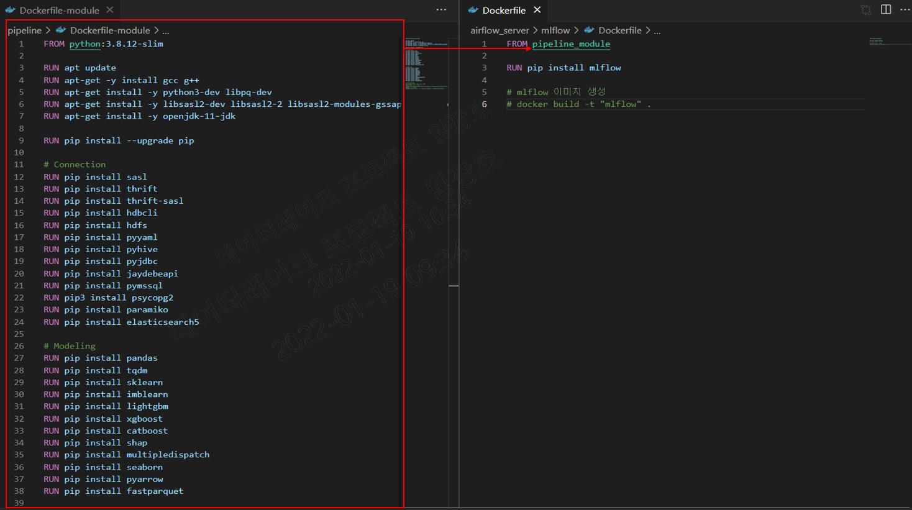  
>
> Mlflow의 설치는 pip install mlflow만 해주면 된다.   
> 머신러닝에 필요한 모듈을 설치하는 이미지를 만들어놨기에 그 이미지에 추가로 mlflow를 설치해준다.  
>
> 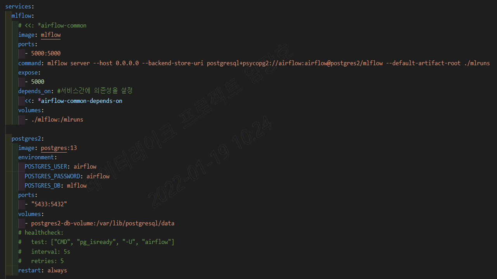  
>
> Mlflow의 정보를 담을 DB와 실행시킬 Mlflow 이미지를 compose 파일에 추가하여 같이 서비스를 시작한다.  
>
> Mlflow의 포트는 5000을 사용한다.  
>
> command의 명령어를 통해 Mlflow를 실행시킨다. 

**<br><span style='color:gray; float: right;'>[TOC ↑](#)</span><br>**

---
# Kafka
> Kafka는 실시간 스트리밍 데이터를 처리하기 위한 목적으로 설계된 오픈 소스 분산형 Publish-Subscribe 플랫폼이다.    
> 기본적으로 데이터를 만들어내는 Producer, 소비하는 Consumer, 이 둘 사이에서 중재자 역할을 하는 Broker로 구성되어있다.   
> Producer는 Broker를 통해 메세지를 publish하며 이 때 메세지를 구독할 Consumer가 브로커에서 요청하여 가져가는 방식이다.   

## Kafka 설치 및 connector생성
    1. 카프카 docker-compose up 실행
    Infrastructure/airflow_server/kafka 디렉토리로 이동하여   
    docker-compose up 
    
    2. connect 플러그인 설치
    # kafka2 컨테이너에서
    cd /opt/kafka_2.13-2.8.1/connectors
    tar -zxvf debezium-connector-mysql-1.5.4.Final-plugin.tar.gz
    
    3. 플러그인 경로 수정
    # kafka2 컨테이너에서
    cd /opt/kafka_2.13-2.8.1/config
    vi connect-distributed.properties
    # 제일마지막줄 
    #plugin.path=  
    # 주석 해제 후
    plugin.path=/opt/kafka_2.13-2.8.1/connectors
    # 으로 변경
    
    4. kafka connect 실행
    # kafka2 컨테이너에서
    connect-distributed.sh /opt/kafka/config/connect-distributed.properties
    
    5. mysql db 및 테이블 생성
    # mysql 컨테이너에서
    $ mysql -u root -p 
    
    $ admin <-- password
    
    mysql> create database testdb;
    
    mysql> use testdb;
    
    mysql> CREATE TABLE accounts (
    account_id VARCHAR(255),
    role_id VARCHAR(255),
    user_name VARCHAR(255),
    user_description VARCHAR(255),
    update_date timestamp,
    PRIMARY KEY (account_id)
    );
    
    mysql> use mysql;
    
    mysql> GRANT ALL PRIVILEGES ON *.* TO 'mysqluser'@'%';
    
    mysql> FLUSH PRIVILEGES;
    
    6. mysql connector생성
    # kafka2 컨테이너에서
    curl --location --request POST 'http://localhost:8083/connectors' \
    --header 'Content-Type: application/json' \
    --data-raw '{
    "name": "source-test-connector",
    "config": {
        "connector.class": "io.debezium.connector.mysql.MySqlConnector",
        "tasks.max": "1",
        "database.hostname": "mysql",
        "database.port": "3306",
        "database.user": "mysqluser",
        "database.password": "mysqlpw",
        "database.server.id": "184054",
        "database.server.name": "dbserver1",
        "database.allowPublicKeyRetrieval": "true",
        "database.include.list": "testdb",
        "database.history.kafka.bootstrap.servers": "kafka:9092",
        "database.history.kafka.topic": "dbhistory.testdb",
        "key.converter": "org.apache.kafka.connect.json.JsonConverter",
        "key.converter.schemas.enable": "true",
        "value.converter": "org.apache.kafka.connect.json.JsonConverter",
        "value.converter.schemas.enable": "true",
        "transforms": "unwrap,addTopicPrefix",
        "transforms.unwrap.type": "io.debezium.transforms.ExtractNewRecordState",
        "transforms.addTopicPrefix.type":"org.apache.kafka.connect.transforms.RegexRouter",
        "transforms.addTopicPrefix.regex":"(.*)",
        "transforms.addTopicPrefix.replacement":"$1"
    }
    }'
    
    # 아래 내용이 뜨면 정상적으로 된 것!
    {"name":"source-test-connector","config":{"connector.class":"io.debezium.connector.mysql.MySqlConnector","tasks.max":"1","database.hostname":"mysql","database.port":"3306","database.user":"mysqluser","database.password":"mysqlpw","database.server.id":"184054","database.server.name":"dbserver1","database.allowPublicKeyRetrieval":"true","database.include.list":"testdb","database.history.kafka.bootstrap.servers":"kafka:9092","database.history.kafka.topic":"dbhistory.testdb","key.converter":"org.apache.kafka.connect.json.JsonConverter","key.converter.schemas.enable":"true","value.converter":"org.apache.kafka.connect.json.JsonConverter","value.converter.schemas.enable":"true","transforms":"unwrap,addTopicPrefix","transforms.unwrap.type":"io.debezium.transforms.ExtractNewRecordState","transforms.addTopicPrefix.type":"org.apache.kafka.connect.transforms.RegexRouter","transforms.addTopicPrefix.regex":"(.*)","transforms.addTopicPrefix.replacement":"$1","name":"source-test-connector"},"tasks":[],"type":"source"}
    
    7. FileStreamSinkConnector 생성
    # kafka2 컨테이너에서
    echo '{
    "name" : "my-first-sink",
    "config" : {
    "connector.class" : "org.apache.kafka.connect.file.FileStreamSinkConnector",
    "file" : "/opt/kafka_2.13-2.8.1/data/test.txt",
    "topics" : "dbserver1.testdb.accounts"
    }}' | curl -X POST -d @- http://localhost:8083/connectors --header "Content-Type:application/json"
    
    # 아래 내용이 뜨면 정상적으로 된 것!
    {"name":"my-first-sink","config":{"connector.class":"org.apache.kafka.connect.file.FileStreamSinkConnector","file":"/opt/kafka_2.13-2.8.1/data/test.txt","topics":"dbserver1.testdb.accounts","name":"my-first-sink"},"tasks":[],"type":"sink"}


해당과정을 수행하면 mysql testdb에 있는 accounts 테이블에 새로운 값이 insert될 때마다 kafka2 컨테이너 안 /opt/kafka_2.13-2.8.1/data/test.txt 파일에 값이 저장되게 된다. 


**<br><span style='color:gray; float: right;'>[TOC ↑](#)</span><br>**

---

# Git

## Gitlab-Runner
> Gitlab Runner는 Go언어로 작성된 GitLab CI와 함께 사용되는 작업수행 프로그램이다. CI(Continuous Integration)는 지속적인 통합이라는 개념으로, 지속적으로 변경내용을 통합해야만하게 되는 시스템을 의미, 대표적인 프로그램으로 젠킨스가 있다.

**<br><span style='color:gray; float: right;'>[TOC ↑](#)</span><br>**

## Gitlab-runner 설치

    # Gitlab-Runner Version 14.5.2
    1. 저장소 다운로드
    sudo curl -L --output /usr/local/bin/gitlab-runner "https://gitlab-runner-downloads.s3.amazonaws.com/latest/binaries/gitlab-runner-linux-amd64"
    
    2. 실행권한 부여
    sudo chmod +x /usr/local/bin/gitlab-runner
    
    3. 서비스 생성
    sudo gitlab-runner install --user=gitlab-runner --working-directory=/home/lotte
    
    4. Gitlab-Runner 등록
    sudo gitlab-runner register
    
    4-1. gitlab 주소 입력(사진에 4번 부분)
    Enter the GitLab instance URL (for example, https://gitlab.com/):
    http://git.lottechilsung.co.kr:7777/
    
    4-2. token 입력(사진에 5번 부분)
    Enter the registration token:
    aeYy2sLjQB8oYnCbgZDy

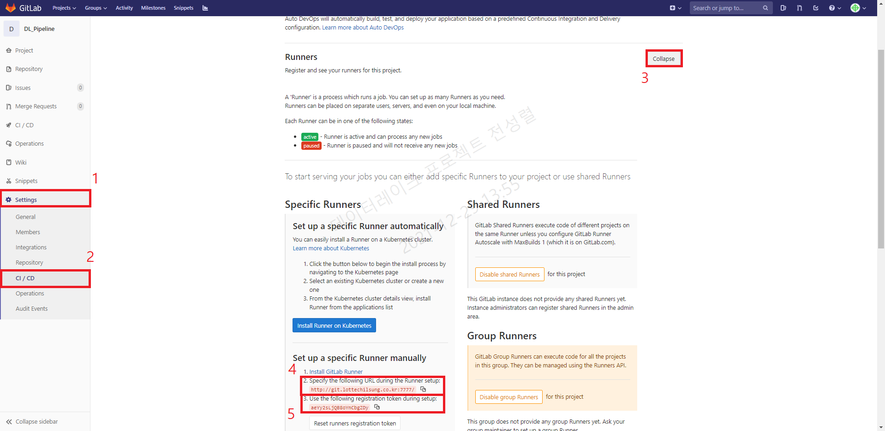

    4-3 runner 설명
    Enter a description for the runner: 
    landing_runner
    
    #tag를 통해 JOB을 지정하므로 다른 Runner와 중복되지 않아야 함
    4-4 runner tag 지정
    Enter tags for the runner (comma-separated):
    landing_runner
    
    # 실행형식에 따라 입력 정보가 다름
    4.5 runner 실행형식 지정
    Enter an executor: parallels, shell, virtualbox, docker+machine, docker-ssh+machine, kubernetes, custom, docker, docker-ssh, ssh: 
    shell
    
    4.6 등록성공 메세지
    Runner registered successfully. Feel free to start it, but if it's running already the config should be automatically reloaded!

**<br><span style='color:gray; float: right;'>[TOC ↑](#)</span><br>**


## Gitlab-Runner 세팅1(CD)

    1. "Gitlab-Runner 설치" 3번에서 지정한 working-directory에 생성된 .gitlab-runner 폴더로 이동

    2. 해당 폴더에 있는 config.toml 수정
    vi config.toml (파일 수정 명령어) 
    [runners.custom_build_dir]하단에 
    enabled = true 추가
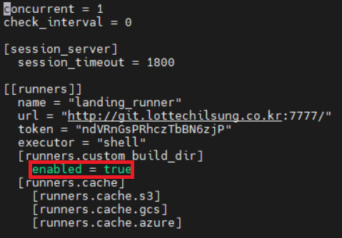

**<br><span style='color:gray; float: right;'>[TOC ↑](#)</span><br>**

## Gitlab-Runner 세팅2(private project인 경우만 진행)

    private project의 경우 pull, push, clone을 진행할 때 아이디와 비밀번호를 입력해야한다. 하지만 Gitlab에는 CI/CD과정에서 토큰 값을 사용하여 pull을 진행할 수 있으므로 git pull 뒤에 ${CI_REPOSITORY_URL} 해당 명령어를 추가해주면 된다.

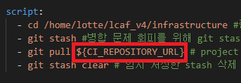    

**<br><span style='color:gray; float: right;'>[TOC ↑](#)</span><br>**

## gitlab-ci

> Gitlab-CI/CD의 파이프라인은 .gitlab-ci.yml 파일로 구성되며 파이프라인의 구조 및 순서를 정의하고 Gitlab-Runner를 이용해서 실행할 일들을 파일에 작성된 스크립트에 따라 순차적으로 동작하게 한다.

**<br><span style='color:gray; float: right;'>[TOC ↑](#)</span><br>**

## gitlab-ci.yml 작성 

> 개발환경에서 Gitlab에 PUSH할 경우 CI/CD를 통해 원격지(서버)에 자동으로 PULL하여 항상 최신파일을 유지하고, DockerOperator를 사용할 경우 자동으로 Docker이미지를 만들도록 작성함
>
> **[[참조] gitlab-ci.yml](../.gitlab-ci.yml)**

**<br><span style='color:gray; float: right;'>[TOC ↑](#)</span><br>**

## CI/CD 파이프라인 확인

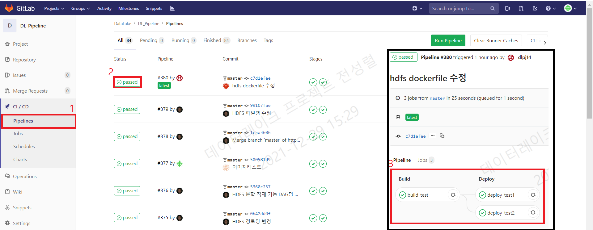

**<br><span style='color:gray; float: right;'>[TOC ↑](#)</span><br>**

---


# 개발 환경 설정

> **로컬 환경 설정 CheckList**
>
> - [ ] WSL  
> - [ ] Docker  
> - [ ] Docker Setting ( docker.sock Permission | Docker Engine | [Storage Change] )  
> - [ ] 개발 Tool  
> - [ ] Git Clone   
> - [ ] Image Build ( Airflow | Pipeline Module | Pipeline Dir | MLFlow | FastAPI )  
> - [ ] Compose Up ( Airflow | MLFlow | FastAPI )   


**<br><span style='color:gray; float: right;'>[TOC ↑](#)</span><br>**

# WSL2

## WSL2란?

>리눅스용 윈도우 하위 시스템(Windows Subsystem for Linux, WSL)은 윈도우 10에서 네이티브로 리눅스 실행 파일(ELF)을 실행하기 위한 호환성 계층이다.   
>
>즉, 윈도우에서 리눅스를 사용하기 위한 도구라고 보면 된다.    
>
>기존에 윈도우에서 Virtual Machine과 같은 도구를 사용하여 느린 리눅스를 사용하거나, 우분투를 따로 설치하여 부팅 때 OS를 선택하여 사용하는 방식보다 훨씬 더 빠르고 효율적이라고 볼 수 있다.   
>
>속도는 Virtual Machine 보다 훨씬 빠르고, 재부팅을 해야 할 필요가 없다.

**<br><span style='color:gray; float: right;'>[TOC ↑](#)</span><br>**

## 고려사항 

>윈도우 10 에서는 WSL를 지원하며, 성능이 더 향상된 버전인 WSL2는 windows 2004(20H1) version에서 지원    
>
>상세 버전을 확인하는 방법은 윈도우 버튼 + R -> winver입력 후 실행을 통하여 확인할 수 있다.

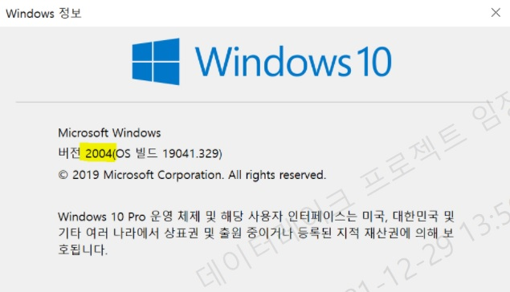

**<br><span style='color:gray; float: right;'>[TOC ↑](#)</span><br>**

## WSL1 vs WSL2

>WSL2는 기존과 다른 VM 환경을 가지고 있다.   
>WSL 1에서 Linux의 System Call을 Windows API로 변환하는 구조였다고 하면, WSL 2에서는 윈도우즈에 리눅스 커널을 아예 올려버렸다고 한다.
>
>WSL1이 윈도우의 api를 이용하기 위하여 변환과정을 거쳤기 때문에, 속도적인 측면에서 불리하였고 일부 api는 변환이 불가능하였다.  
>
>하지만, WSL2는 linux 커널을 포함하고 있기 때문에, linux의 모든 api를 지원한다.

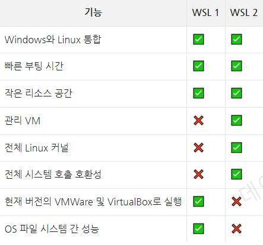

##### 출처: http://melonicedlatte.com/2020/07/05/200400.html   

**<br><span style='color:gray; float: right;'>[TOC ↑](#)</span><br>**

## WSL2 설치

    WSL2 활성화 명령어 실행

    # WSL feature Enable
     - dism.exe /online /enable-feature /featurename:Microsoft-Windows-Subsystem-Linux /all /norestart
    
    # Virtual Machine Platform feature Enable
     - dism.exe /online /enable-feature /featurename:VirtualMachinePlatform /all /norestart
    
    두 명령어를 실행 후 '작업을 완료했습니다' 출력으로 종료되었는지 확인한 뒤 재부팅을 한번 하면 된다.
    
    아래의 링크를 통해 x64 머신용 최신 WSL2 Linux 커널 업데이트 패키지를 다운받아 안내에 따라 설치를 진행

> - [x64 머신용 최신 WSL2 Linux 커널 업데이트 패키지](https://wslstorestorage.blob.core.windows.net/wslblob/wsl_update_x64.msi)

**<br><span style='color:gray; float: right;'>[TOC ↑](#)</span><br>**


### 원하는 Linux Version 설치

>- Ubuntu 16.04 LTS
>- Ubuntu 18.04 LTS
>- Ubuntu 20.04 LTS
>- openSUSE Leap 15.1
>- SUSE Linux Enterprise Server 12 SP5
>- SUSE Linux Enterprise Server 15 SP1
>- Kali Linux
>- Debian GNU/Linux
>- Fedora Remix for WSL
>- Pengwin
>- Pengwin Enterprise
>- Alpine WSL
>- ...
>
>위와 같은 수많은 버전을 지원하고 있다.
>
>Windows store 혹은 설치파일을 통해 Linux 설치를 진행

**<br><span style='color:gray; float: right;'>[TOC ↑](#)</span><br>**

### WSL2로 변환

    Powershell 혹은 CMD를 통해 설치한 Linux의 WSL 버젼을 확인

    # Windows PowerShell or CMD command
    wsl -l -v
    
    # wsl2로 변환
    wsl --set-version <distribution Name> <versionNumber>
    ex) wsl --set-version CentOS 2
    
    # WSL2를 Default로 설정
    wsl --set-default-version 2
    
    # 변환이 진행되면 메세지가 출력
    변환이 진행 중입니다. 몇 분 정도 걸릴 수 있습니다...
    WSL 2와의 주요 차이점에 대한 자세한 내용은 https://aka.ms/wsl2를 참조하세요
    변환이 완료되었습니다.
    
    # 변환이 적용되었는지 확인
    wsl -l -v

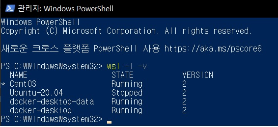

**<br><span style='color:gray; float: right;'>[TOC ↑](#)</span><br>**

---

# Docker 수동설치

## Install

    # docker desktop을 이용하여 docker를 사용할 수 있지만 2022년 1월 28일부로 라이센스가 유료화 되어 
    # wsl을 통해 리눅스에서 rpm파일을 이용한 수동설치 진행
    # docker for Desktop을 설치하지 않았을 경우 2번부터 진행
    # docker version 20.10.12
    # WSL - CentOS로 진행
    
    1. docker for Desktop 삭제
        - 설정 / 앱 / docker for desktop 제거 
        - $ sudo yum erase docker docker-common
    
    2. Docker 저장소 설치 
    $ sudo yum install -y yum-utils device-mapper-persistent-data lvm2
    
    3. [https://download.docker.com/linux/centos/7/x86_64/stable/Packages/]에서 아래 rpm 파일 전부 다운로드
    3-1. 다운로드 파일 리스트  
    docker-ce-20.10.12-3.el7.x86_64.rpm  
    docker-ce-cli-20.10.12-3.el7.x86_64.rpm  
    docker-ce-rootless-extras-20.10.8-3.el7.x86_64.rpm  
    docker-scan-plugin-0.8.0-3.el7.x86_64.rpm  
    containerd.io-1.4.12-3.1.el7.x86_64.rpm  


    4. rpm파일을 다운받은 디렉토리로 이동하여 docker 설치
    $ cd {다운받은 디렉토리}
    $ sudo yum install docker-ce-20.10.12-3.el7.x86_64.rpm docker-ce-cli-20.10.12-3.el7.x86_64.rpm docker-ce-rootless-extras-20.10.8-3.el7.x86_64.rpm docker-scan-plugin-0.8.0-3.el7.x86_64.rpm containerd.io-1.4.12-3.1.el7.x86_64.rpm
    
    1. docker - daemon.json 수정
    $ vi /etc/docker/daemon.json
    
    {
        "dns":[
            "10.120.1.24",
            "10.120.1.25"
        ],
        "dns-search":[
            "lottechilsung.co.kr"
        ]
    } 
    해당 내용 입력 후 저장 만약 daemon.json이 없다면 생성하여 진행 
    
    1. docker start 
    $ sudo systemctl start docker 
    
    # Failed to get D-Bus connection: Operation not permitted 에러가 발생할 경우
    $ mv /usr/bin/systemctl /usr/bin/systemctl.old
    $ curl https://raw.githubusercontent.com/gdraheim/docker-systemctl-replacement/master/files/docker/systemctl.py > /usr/bin/systemctl
    $ chmod +x /usr/bin/systemctl
    해당 과정 진행 후 6번 과정 다시 시도 
    
    1. docker daemon 실행확인
    $ dockerd -D
    
    1. /etc/resolv.conf 수정
    $ vi /etc/resolv.conf 
    search lottechilsung.co.kr 추가
    
    1. docker image 저장소에 접속하기 위한 인증서 다운로드
    $ openssl s_client -showcerts -servername "docker.io" -connect docker.io:443 > cacert.pem
    
    10 인증서 위치 변경
    $ cp cacert.pem /etc/ssl/certs/
    
    11 설정 적용 및 docker daemon 실행
    $ update-ca-trust
    $ systemctl restart docker
    $ dockerd -D
    
    # 새로운 터미널에서 버전확인
    $ docker info 
    
    # PC를 재시작 후 docker를 실행시켜줘야한다
    명령어 : $ dockerd -D
    
    ※ C드라이브의 용량이 적어 D드라이브로 변경하려면 https://github.com/pxlrbt/move-wsl 참고
    ## 1. 위의 git에서 코드 다운로드
    ## 2. powershell에서 실행중인 wsl 종료
    ## > wsl -t <WSL SERVICE[CentOS]>
    ## 3. 다운받은 코드 실행
    ## > code/download/path/move-wsl.ps1
    ## WSL의 드라이브를 바꾸기 때문에 data-root 변경 필요성 없음
    ## 드라이브를 변경하지 않고 data-root를 mnt 하위 폴더로 지정시 failed to register layer: ApplyLayer exit status 1 stdout:  stderr: lchown /etc: no such file or directory 에러 발생
    
    # Containter를 외부 접속하려면 포트 포워딩 필요!
    # dev_guide폴더에서 port_wsl.ps1 복사 및 실행 (포워딩할 포트는 스크립트 내에서 직접 수정)
    ## 부팅 시마다 도커의 가상 네트워크인 eth0의 IP가 변경되므로 부팅할 때마다 dockerd -D / port_wsl.ps1 실행
    ※ 포트 포워딩을 하지 않으면 localhost:port 로 접근은 가능하지만 host_ip:port 접근 불가능하므로 컨테이너들끼리 통신이 필요하다면 포트 포워딩을 해줘야 한다.

**<br><span style='color:gray; float: right;'>[TOC ↑](#)</span><br>**

---

# 개발툴 설치

## VSCode

[VSCode 공식 홈페이지](https://code.visualstudio.com/)

    1. 위의 링크로 접속하여 본인의 OS에 맞는 설치 프로그램 다운로드

    2. 다운로드한 VSCode 설치파일 실행

    3. 라이센스 관련 동의 체크 후 다음 클릭

    4. 설치할 경로 확인 후 다음 클릭

    5. 시작 메뉴 관련 설정 후 다음 클릭

    6. 추가 작업 설정 후 다음 클릭
     - 1) 아이콘 추가 : 바탕 화면에 VSCode 아이콘을 만들기  
     - 2) 두 번째, 세 번째 "code(으)로 열기" : 폴더나 파일을 VSCode로 바로 열 수 있도록 마우스 우클릭 메뉴에 code(으)로 열기를 표시해 준다.  
     - 3) VSCode를 기본 편집기로 사용하고 싶은 경우 체크하자.  
     - 4) PATH에 추가 :  명령 창(CMD, 파워셀 등)에서 code를 입력하면 VSCode가 바로 실행 된다.

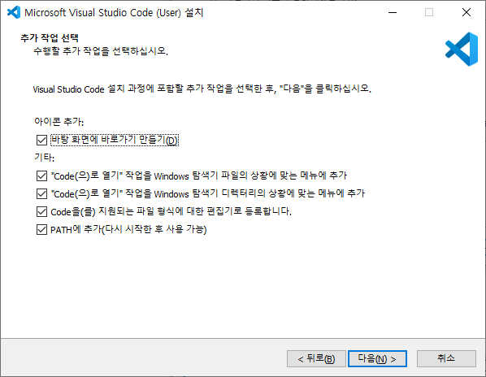

    7. 설치 클릭

    8. 설치 완료 후 Visual Studio Code 실행

#### 출처: https://goddaehee.tistory.com/287   


**<br><span style='color:gray; float: right;'>[TOC ↑](#)</span><br>**

## 추천 VSCode Extension

>Bracket Pair Colorizer2
> - 코드에서 사용되는 괄호를 짝을 맞추어 색을 다르게 해주어 직관적으로 괄호의 범위를 알 수 있도록 도와주는 확장 도구  
>  설정을 통해 색을 변환할 수도 있다.
>
>indent-rainbow
> - 들여쓰기를 보다 쉽게 볼 수 있는 간단한 확장 도구
>
>Remote - WSL
> - VSCode 터미널에서 WSL의 터미널을 사용할 수 있게 해주는 확장 도구
>
>위와 같은 여러 편의성을 가진 Extension이 많아 필요한 Extension을 찾아서 추가해보셔도 됩니다.

**<br><span style='color:gray; float: right;'>[TOC ↑](#)</span><br>**

---

## Git 연결

    #CentOS에 git 설치
    yum install git 
    
    #git clone을 할 곳으로 디렉토리 이동
    cd <directory>
    
    #github
    git clone <gitlab 주소>

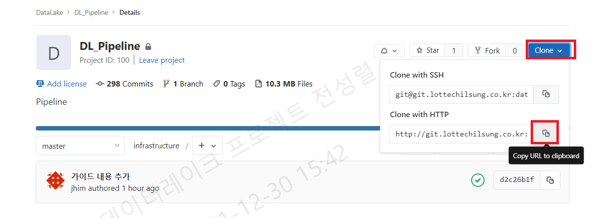

**<br><span style='color:gray; float: right;'>[TOC ↑](#)</span><br>**

---

## Airflow 로컬 설치 

>DataLake 프로젝트에서는 Docker에서 Airflow를 실행하기 때문에 CentOS에서 설치할 필요없이 Docker이미지를 통해 Airflow를 실행.  
>git clone받은 프로젝트에서 airflow_server디렉토리에 있는 docker-compose.yaml을 통해 바로 Airflow를 실행시킬 수 있다. 

**<br><span style='color:gray; float: right;'>[TOC ↑](#)</span><br>**

### Airflow와 docker-compose.yaml

>docker-compose는 다중 컨테이너 애플리케이션을 정의 및 공유할 수 있고 단일 명령을 사용하여 모두 실행 또는 종료할 수 있도록 개발된 도구이다.  
>
>Airflow는 standalone을 통해 단일 컨테이너에서 실행시킬 수 있지만 프로덕션환경에서는 부적합하기 때문에 worker, scheduler, webserver, database 등등 여러 컨테이너를 나누고 다중 노드 방식으로 실행. 

**<br><span style='color:gray; float: right;'>[TOC ↑](#)</span><br>**

### docker-compose.yaml 파일 설명 

**[[참조]docker-compose.yaml](../airflow_server/docker-compose.yaml)**

    version : '3'                                   #yaml포맷버전
    x-airflow-common:, &airflow-common              #공통되는 이미지 정의하여 사용
    image: ${AIRFLOW_IMAGE_NAME:-airflow_server}    #컨테이너를 올릴 때 사용할 이미지
                                                     airflow_server는 모듈이 추가된
                                                     커스텀 이미지
    enviroment:, &airflow-common-env                #공통되는 설정(DB, Executor)을
                                                     정의하여 사용
    volumes:                                        #컨테이너에서 저장된 데이터들을
                                                     로컬과 연동하기 위한 부분

 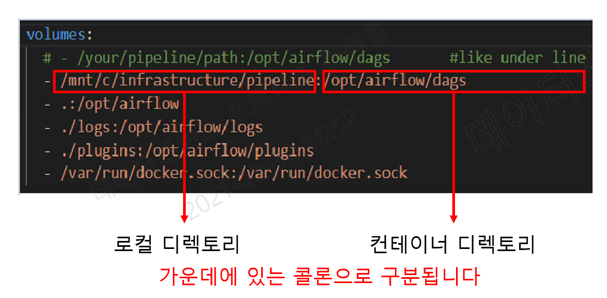

    privileged: true                                #도커는 Default로 Unprivileged
                                                     모드로 실행되어 시스템 주요 자원에
                                                     접근할 권한이 부족하기 때문에
                                                     네트워크 / 디렉토리 접근을 위해
                                                     privileged 옵션을 부여
    
    depends_on:                                     #컨테이너 간의 종속성을 표현
                                                     Airflow는 worker,scheduller,
                                                     webserver가 실행되기 전
                                                     DB와 Broker가 먼저 실행되야하기때문에
                                                     필요한 옵션
    
    services:                                       # 생성할 컨테이너 항목들을 정의하는 옵션   

**<br><span style='color:gray; float: right;'>[TOC ↑](#)</span><br>**

### Airflow 실행 

    1. VSCode 실행 
    개발툴인 VSCode를 실행 
    
    2. 프로젝트가 있는 폴더 열기 
    VSCode 상단메뉴에 파일에서 폴더열기를 누른 후 
    프로젝트가 있는 폴더를 열어준다


    3. VSCode 상단메뉴에 터미널에서 새 터미널 클릭 후
    아래 사진처럼 CentOS 터미널을 열어준다.

 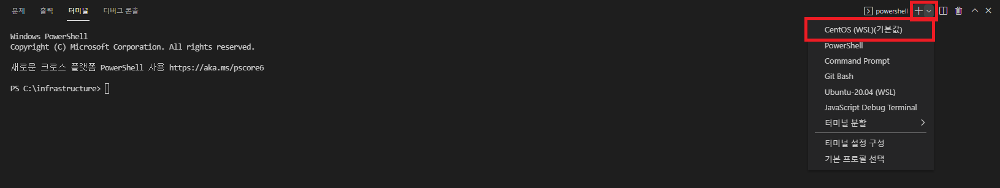

    4. 터미널의 디렉토리가 프로젝트 최상위 디렉토리이므로 airflow_server로 이동
    cd airflowr_server
    
    5. Airflow 이미지 빌드
    apache/airflow:2.2.2=python3.8 이라는 공식이미지를 통해 Airflow를 실행할 수 있지만
    모델링에 필요한 모듈들이 Import되어 있지 않기 때문에 공식이미지를 기반으로 한 커스텀 이미지를 만들어야 한다.
    docker build -t "airflow_server" . 명령어 입력

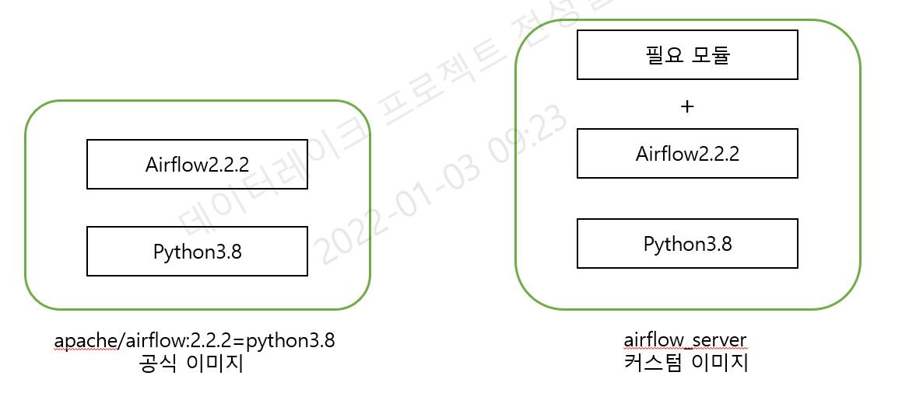

    6. Airflow 실행(docker-compose up) 
    터미널에 docker-compose up 명령어를 입력


**<br><span style='color:gray; float: right;'>[TOC ↑](#)</span><br>**


# 개발 가이드

## 개요 및 아키텍쳐

> 프로젝트 개요  
> 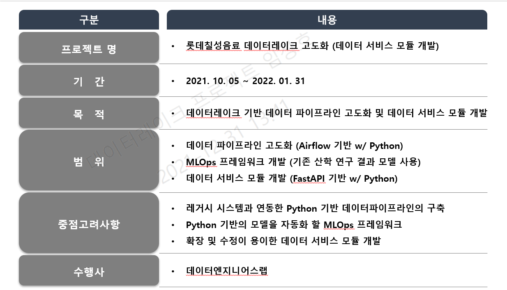

> 데이터 파이프라인 아키텍쳐  
> 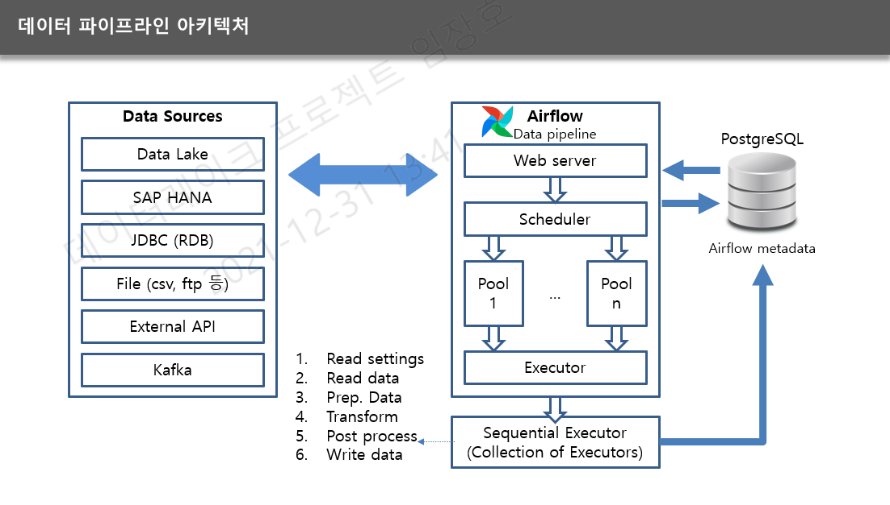

**<br><span style='color:gray; float: right;'>[TOC ↑](#)</span><br>**

---

## 패키지 구조

> **<u>Gitlab - DL_Pipeline 패키지 구조</u>**

**Infrastructure**
  - Airflow_server
    - logs
    - Dockerfile
    - requirements.txt
    - docker-compose.yaml
  - Pipeline
    - p00_data
      - drivers
        - driver.jar
      - alert.py
      - app.py
      - db_info.yaml
      - es.py
      - util_hdfs.py
    - p01_preps
      - app.py
    - p02_xforms
      - app.py
    - p03_models
    - p04_pipelines
      - bw_sales_use_dockeroperator...
        - source_code.py
        - pipeline_DAG.py
        - Dockerfile
      - credit_use_pythonoperator...
        - pipeline_DAG.py
        - parameter.yaml
      - customer...
      - outstanding...
      - any pipelines directory...


**<br><span style='color:gray; float: right;'>[TOC ↑](#)</span><br>**

---

## Data

    Data 입수 관련 Application Directory
     - drivers             # DB연결에 필요한 Driver 파일 적재 폴더
     - alert.py            # DAG 실행 후 결과 알림을 위한 모듈 (Slack / Webex)
     - config.py           # db_info.yaml 파일을 읽어오는 함수를 가진 모듈
     - db_info.yaml        # database들의 정보를 가지고 있는 파일
     - es.py               # Elastic Search의 Connection 함수를 가진 모듈
     - util_hdfs.py        # HDFS의 Connection과 Write에 대한 함수를 가진 모듈
     - app.py              # 여러 Database의 Connection 함수를 가진 모듈

app.py 구성

    db_info.yaml의 정보를 불러와서 각 DB에 맞는 pyhive와 같은 모듈을 사용해 Connection을 해주는 Adaptor 생성 
    # Class를 import한 뒤 함수를 사용
    
     - HIVE (pyhive)
     hive.connect(host = <IP host>, port = <Port>, username = <username>, password = <password>, database = <dbname>)
    
     - SAP HANA (hdbcli)
     dbapi.connect(address = <IP host>, port = <port>, username = <username>, password = <password>)
    
     - Sqlserver (pymssql)
     pymssql.connect(server = <SQLSERVER_HOST>, port = <SQLSERVER_PORT>, user = <SQLSERVER_USERNAME>, password = <SQLSERVER_PASSWORD>, database = <SQLSERVER_DATABASE>, as_dict = True)
     
     - Tibero (jaydebeapi)
     jp.connect(jclassName, url=<url>, driver_args={"user":<username>, "password":<password>}, jars=<Driver Path>)
    
     - Postgresql (psycopg2)
     psycopg2.connect(host = <POSTGRES_HOST>, port = <POSTGRES_PORT>, user = <POSTGRES_USERNAME>, password = <POSTGRES_PASSWORD>, dbname = <POSTGRES_DBNAME>)
    
     - Openapi (return API_URL)
     API_URL + API_Key
    
     - SFTP (paramiko) (return ftp)
     ssh.connect(<SFTP_HOST>, <SFTP_PORT>, <SFTP_USER>, <SFTP_PASSWORD>)
     ftp = ssh.open_sftp()


    ==== 개발 완료 목록 ====
    01. hive_adaptor                    
    02. hana_db_adator                  
    03. hana_bw_adaptor
    04. sqlserver_adaptor
    05. tibero_adaptor
    06. postgre_adaptor
    07. openapi_data_kma_adaptor
    08. sftp_adaptor
    09. es_adaptor
    10. webex alert
    11. slack alert
    12. hdfs_adaptor
    
    input.yaml 구성
    
     - 각 모델별 input이 되는 Query 관리 (원천 테이블 / 전처리된 중간 테이블 등)
    
    output.yaml 구성
    
     - 각 모델별 output이 되는 테이블명 관리 (해당 테이블명대로 Database에 Insert)

### Webex 알림 설정
> Webex 봇 추가   
> 1. https://developer.webex.com/docs/bots 접속
>
> 2. Create a Bot 버튼 클릭
>   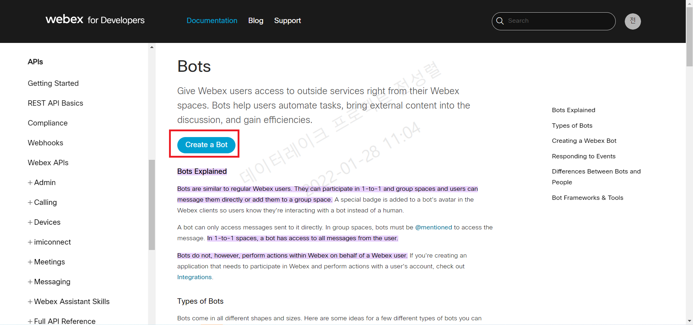
>
> 3. Bot name, Bot username, Icon, Description 입력 후 Add Bot 클릭
>   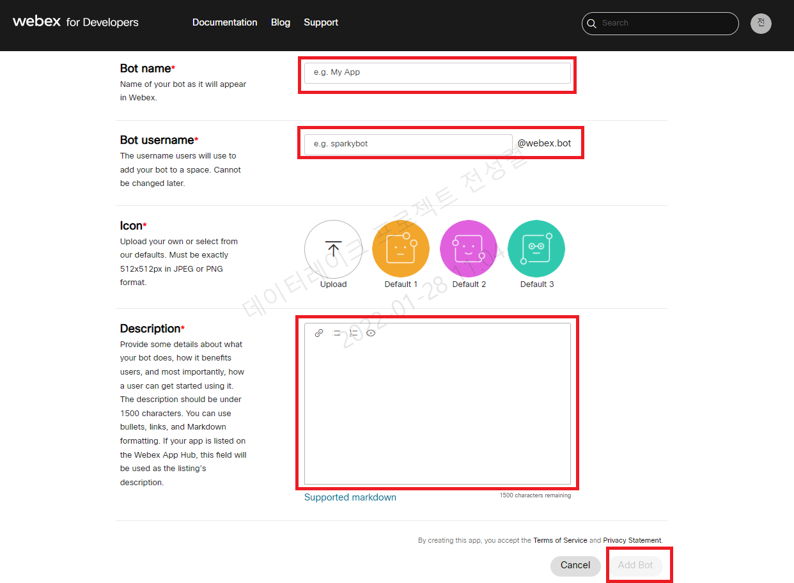
>
> 4. 생성이 완료되면 Bot access token이 보이는데 Copy Token 버튼을 눌러 저장 
>   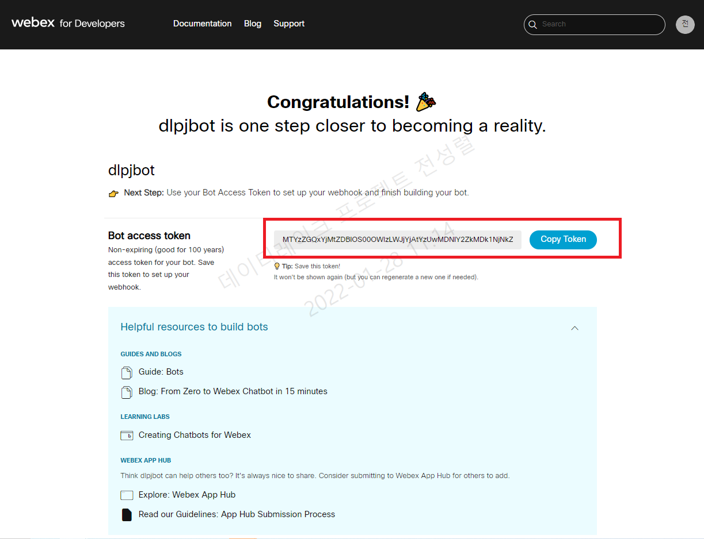
>
> 5. 봇을 추가할 스페이스로 이동 
>
> 6. 사용자목록에서 사용자 추가 클릭 
>
> 7. 아까입력한 {Bot username}@webex.bot 입력하여 봇 찾기 후 추가
>   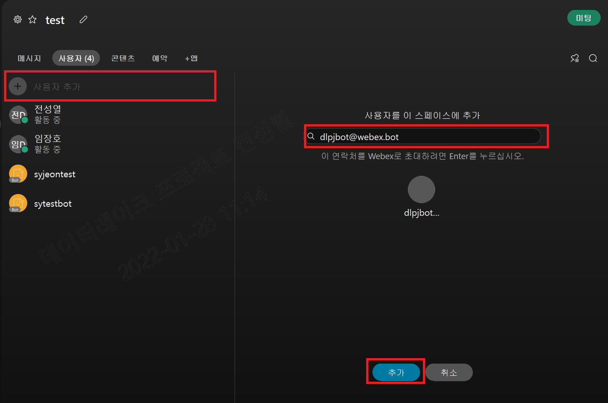
>
> Webex 봇 알림 설정
> 1. 봇을 추가한 스페이스의 설정 진입 후 스페이스 링크 복사 클릭
>   ex) webexteams://im?space=ac3a8d10-27f2-11ec-befa-5fd8bb9e1578
>   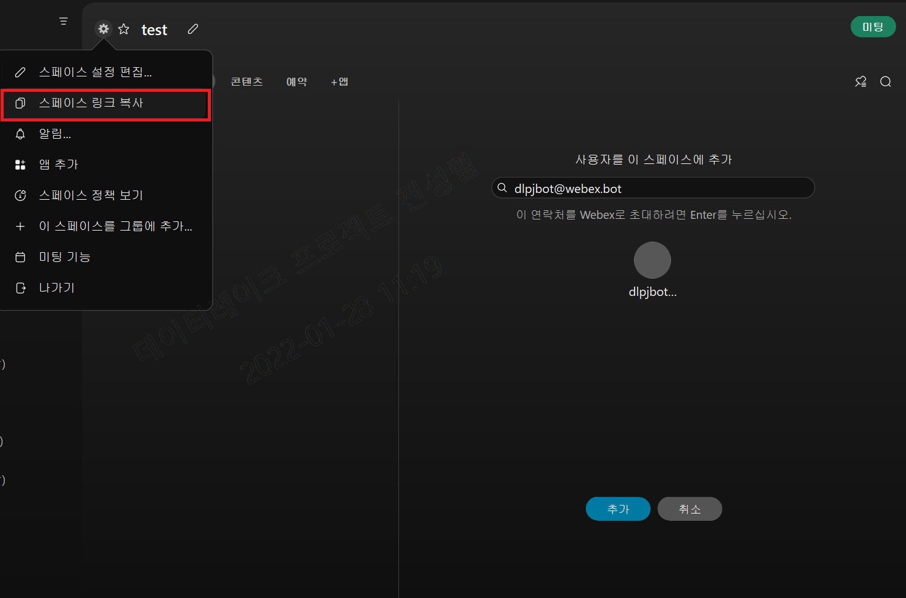
>
> 2. 링크에서 space= 뒷부분 복사 (ac3a8d10-27f2-11ec-befa-5fd8bb9e1578)
>
> 3. infrastructure -> pipeline -> p00_data -> alert.py 이동
>
> 4. WEBEXAlert class에 있는 success_alert, fail_alert 에서 access_token에 webex 봇 추가 4번과정에서 복사한 토큰입력
>   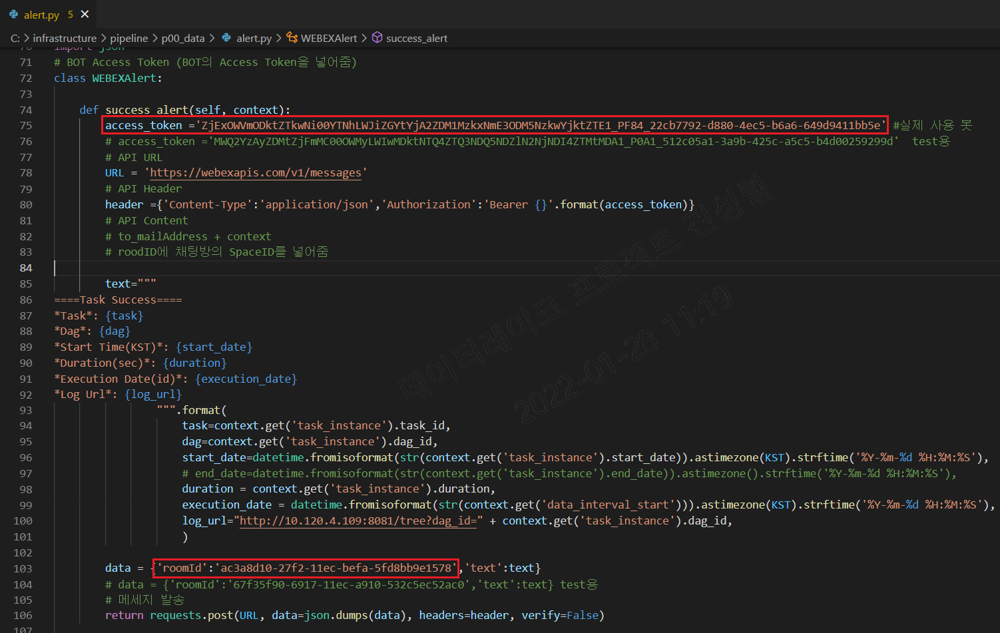
>
> 5. 같은 함수에 data 변수에 있는 'roomId' 를 webex 봇 알림 설정 2번에서 복사한 값 입력
>
> 6. DAG에 설정
>   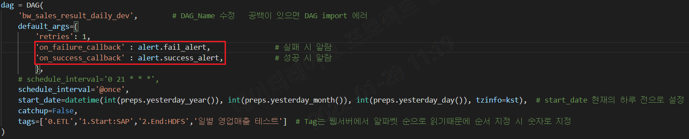

**<br><span style='color:gray; float: right;'>[TOC ↑](#)</span><br>**

---

## Airflow 모듈 추가

    pip 모듈 추가하려면 Operator에 따라 방법이 다름

> PythonOperator 사용 시 pip Module 추가 방법  
> 원칙적으론 airflow_server 폴더 내에 requirement.txt에 추가할 모듈을 입력 후  
> 서버에서 docker image build -> docker-compose down / up 단계를 거쳐 Dependency를 맞춰줘야 함  
>
> 그 외의 방법으로는  
> 서버에 접속해서 해당 Container에 진입 후 pip install를 진행해도 설치가 됨 
>
> ```bash
> docker exec -it [Container id] /bin/bash
> ```
>
> 
>
> > !! 109번 airflow Container 진입시 root 계정에서 airflow 변경
> >
> > ```bash
> > su airflow
> > ```
> >
> > 
>
> > 설치 진행해야 할 Container 목록  
> > airflow-triggerer  
> > airflow-scheduler  
> > airflow-webserver  
> > airflow-worker  
>
> Container에 진입 후 아래 단계를 거치면 설치가 됨  

### PythonOperator 사용 시 
    # Container 진입 명령어   !에는 triggerer / scheduler / webserver / worker 입력
    $ docker exec -it airflow_server_airflow-<!>_1 bash
    
    # In Airflow Containers
    $ su airflow            # Airflow_server 에서 root가 default로 잡혀있어 user 변경을 해야함
    
    $ pip install <module>
    
    # 106 / 107 Worker 사용 시 각 서버에서 위와 같이 진행
    # 106 / 107번 서버는 airflow-worker Container만 존재!
    # 106 / 107 Worker는 user가 airflow이므로 su 진행 하지않아도 됨
    
    ## 주의] 위 방법은 pip Dependency가 깨질 수 있기에 설치 진행에 유의해야 함

### DockerOperator 사용 시  

    pipeline폴더 내 Dockerfile-module에 pip install <module> 추가


**<br><span style='color:gray; float: right;'>[TOC ↑](#)</span><br>**

---

## Preps

    Data PreProcessing 관련 Application Directory
     - app.py       # 전처리를 위한 함수들을 가진 모듈

app.py 구성

    01. before_last_day                 # 전월 말일 구하기
    02. last_day                        # 당월 말일 구하기
    03. today                           # 오늘 날짜 구하기
    04. this_year                       # 당년 구하기
    05. this_month                      # 당월 구하기
    06. before_year                     # 전달 연도 구하기
    07. before_month                    # 전달 월 구하기
    08. day                             # 일 구하기
    09. before_year_month               # 전월 연도 및 월 구하기
    10. this_year_month                 # 당월 연도 및 월 구하기
    11. week_of_month                   # 월 주차 구하기
    12. Hive_partitioning               # Hive 파티셔닝
    13. rename                          # 컬럼 리네임
    14. numeric_to_binominal_mapping    # 형변환 Numeric > Binominal Mapping
    15. numeric_to_binominal            # 형변환 Numeric > Binominal
    16. numeric_to_polynominal_mapping  # 형변환 Numeric > Polynominal mapping
    17. numeric_to_polynominal          # 형변환 Numeric > Polynominal
    18. numeric_to_date                 # 형변환 Numeric > Date
    19. integer_to_real                 # 형변환 Integer > Real
    20. real_to_integer                 # 형변환 Real > Integer
    21. nominal_to_binominal            # 형변환 Nominal > Binominal
    22. nominal_to_text                 # 형변환 Nominal > Text
    23. nominal_to_numeric              # 형변환 Nominal > Numeric
    24. nominal_to_date                 # 형변환 Nominal > Date
    25. text_to_nominal                 # 형변환 Text > Nominal
    26. date_to_numeric                 # 형변환 Date > Numeric
    27. date_to_nominal                 # 형변환 Date > Nominal
    28. parse_number                    # 형변환 Parse number (string > number)
    29. format_numbers                  # 형변환 Format number (number > string)
    30. select_attributes               # 선택 Select attributes
    31. select_by_random                # 선택 Select by random
    32. remove_attributes               # 선택 Remove attributes
    33. filter_examples                 # 필터링, 샘플링, 소팅 Filter examples
    34. sample                          # 필터링, 샘플링, 소팅 Sample
    35. split_rows                      # 필터링, 샘플링, 소팅 Split      
    36. sort                            # 필터링, 샘플링, 소팅 Sort
    37. shuffle                         # 필터링, 샘플링, 소팅 Shuffle
    38. split_columns                   # 값 Split
    39. substring                       # 값 Substring
    40. trim                            # 값 Trim
    41. merge                           # 값 Merge
    42. add                             # 값 Add
    43. days_split_upload_date_setting  # 날짜 분할 적재 날짜 세팅
    44. days_split_upload_sql_setting   # 날짜 분할 적재 쿼리 세팅
    45. days_split_upload               # 날짜 분할 적재
    46. hdfs_split_upload               # HDFS 분할 적재


**<br><span style='color:gray; float: right;'>[TOC ↑](#)</span><br>**

---

## Xforms

    Data Transform 관련 Directory
     - app.py

app.py 구성

    01. null                # 정제 Null

**<br><span style='color:gray; float: right;'>[TOC ↑](#)</span><br>**

---

## Models

    Modeling 관련 Directory

**<br><span style='color:gray; float: right;'>[TOC ↑](#)</span><br>**

---

## Pipelines

    Pipeline 관련 Directory

    하나의 파이프라인당 하나의 Directory를 가지는 구조
    각 파이프라인 Directory에는 최소 3개의 파일을 가지고 있다

> DockerOperator 사용시   
> > Pipeline_DAG.py  
> >   설정값을 내포하는 .yaml  
> >   Business Logic을 가지는 python.py  
> >   실행코드를 Build 시킬 Dockerfile

> PythonOperator 사용시   
> > Pipeline_DAG.py   
> >    설정값을 내포하는 .yaml 

**<br><span style='color:gray; float: right;'>[TOC ↑](#)</span><br>**

### PythonOperator vs DockerOperator
> Datalake프로젝트는 PythonOperator와 DockerOperator 방식이 모두 구현되어 있다.  
> 각각의 장단점이 있으므로 선택해서 사용할 것  
> 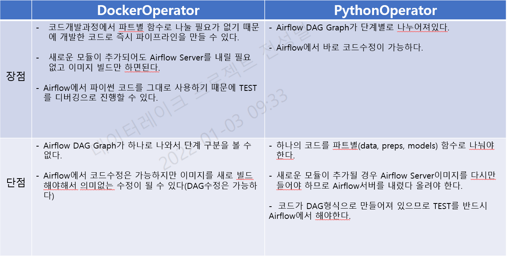

**<br><span style='color:gray; float: right;'>[TOC ↑](#)</span><br>**


### PythonOperator 작성법

>pipeline_directory
> - **<span style='color:yellow'>DAG.py   </span>**

    PythonOperator를 사용하는 경우 함수 단위로 호출하여 사용해야하므로  
    Source Code를 PythonOperator에서 사용할 수 있도록 파트별로 함수로 분리해야한다.
    현재 만들어진 ETL PythonOperator 파이프라인은 대부분 extract, xforms, load구조로 생성되어있다. 용량이 큰 DataFrame은 Xcom으로 전달되지 않으므로 파이프라인 폴더에 있는 dataset폴더 경로로 pickle형태로 저장 후 불러오는 방식을 사용하여 Task간 DataFrame을 전달한다.
    *dataset폴더는 CI/CD를 통해 자동으로 생성되므로 수동으로 만들어줄 필요는 없다.
    
    Jupyter를 사용할 경우 Python파일로 변환 및 DAG파일로 변환하는 작업이 필요하기 때문에 Cell을 같은 Task에 들어갈 부분끼리 묶어 두는 것이 편리하다.

ex) Jupyter Code
> 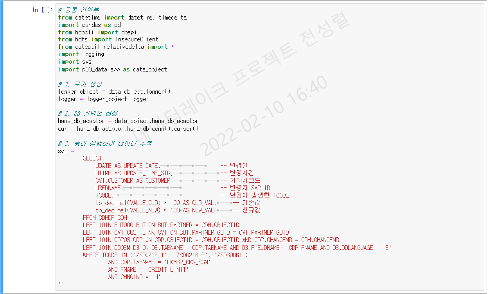
> 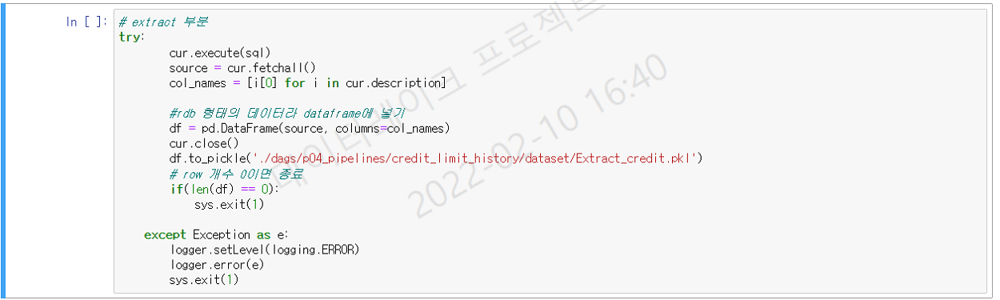
> 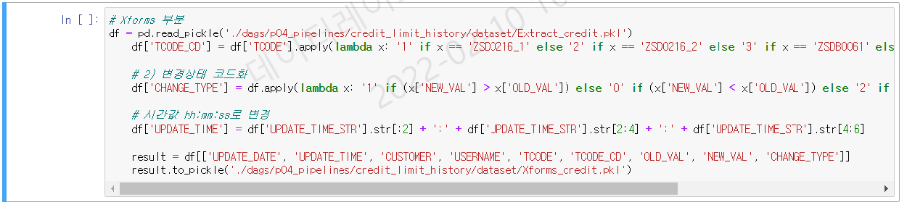
> 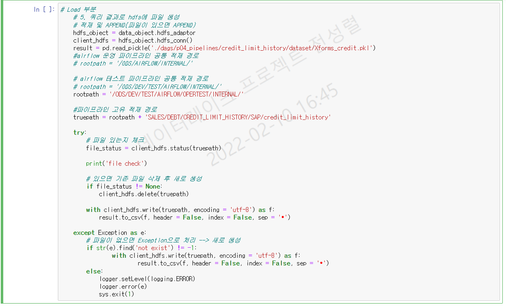


ex) PythonOperator Code
```Python
from datetime import datetime
from airflow import DAG
from airflow.operators.python import PythonOperator
from p00_data.alert import WEBEXAlert 

alert = WEBEXAlert()  ##알림모듈 불러오기

def extract():
    # data_import부분의 Souce Code

    # db에서 뽑아낸 dataframe을 pickle로 저장
    df1.to_pickle("./dags/p04_pipelines/{pipeline name}/dataset/{filename}.pkl")

def xforms():
    # pickle로 저장된 데이터를 dataframe으로 불러오기
    df1 = pd.read_pickle("./dags/p04_pipelines/{pipeline name}/dataset/{filename.pkl") 

    # 가져온 데이터 전처리

    # 전처리한 dataframe을 pickle로 저장
    df2.to_pickle("./dags/p04_pipelines/{pipeline name}/dataset/{filename}.pkl")

def load():
    # pickle로 저장된 전처리 데이터를 dataframe으로 불러오기
    df2 = pd.read_pickle("./dags/p04_pipelines/{pipeline name}/dataset/{filename.pkl") 
    #전처리된 데이터로 modeling
#=========================================================================
dag = DAG(                                              #공통으로 사용할 dag옵션지정
    'PythonOperator_Example',                           #DAG이름 지정
    default_args={                                      
        'on_failure_callback' : alert.fail_alert,       #실패했을 경우 알람을 보내는 함수 호출
        'on_success_callback' : alert.success_alert,    #성공했을 경우 알람을 보내는 함수 호출
        },
    schedule_interval='0 */1 * * *',                    #스케줄 지정(* * * * *) -> (분 시 일 월 년) 해당내용은 매 시간 0분마다 DAG실행을 의미함
    # schedule_interval='@once',                        #DAG를 1번만 실행하는 코드 
    start_date=datetime(2021, 12, 30),                  #start_date 현재의 하루 전으로 설정
    tags=['PythonOperator_Test']                                    #DAG의 tag지정
)

task1 = PythonOperator(                                 #PythonOperator
    task_id='extract',                                  #task_id 지정
    python_callable=extract,                            #불러올 함수 지정
    dag=dag                                             #dag설정 
)
task2 = PythonOperator(
    task_id='xforms',
    python_callable=xforms,
    dag=dag
)
task3 = PythonOperator(
    task_id='load',
    python_callable=load,
    dag=dag
)

task1 >> task2 >> task3                                 #Task 순서 지정
```


**<br><span style='color:gray; float: right;'>[TOC ↑](#)</span><br>**

### DockerOperator 작성법

>pipeline_directory  
> - **<span style='color:yellow'>Source.py   </span>**
> - Dockerfile
> - DAG.py  

    DockerOperator를 사용하는 경우
    Source Code는 Jupyter 혹은 Python으로 작성하여 xxx.py로 저장하여 py파일을 가진 이미지를 빌드해주고 Operator를 통해서 Docker Image가 가지는 xxx.py파일을 실행하게된다.
    
    Docker Container라는 독립적인 VM 환경에서 Python Code가 실행되기 때문에 개발자가 작성한 xxx.py파일을 바로 사용할 수 있다.
    
    xxx.py의 테스트를 로컬에서 Jupyter / Python으로 Test한 후 Airflow에서 실행시키기 위해 이미지 빌드를 진행하면 된다.
    
    **중요사항**
    DockerOperator는 이미지를 불러와 실행하는 Operator이다. 
    이미지는 git push를 할 경우 CI/CD를 통해 자동으로 생성되며 이미지 이름은 해당 파이프라인 디렉토리의 이름이다. 
    그러므로 DAG작성시 이미지를 지정하는 곳에 반드시 파이프라인의 디렉토리명이 들어가야한다.
    
    ex)
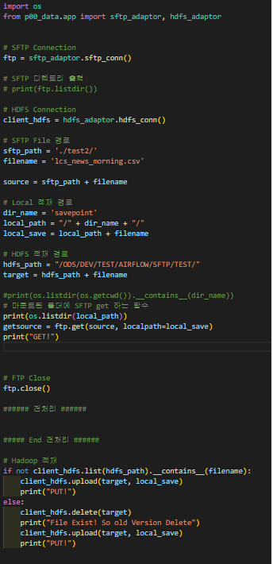


>pipeline_directory  
> - Source.py   
> - **<span style='color:yellow'>Dockerfile</span>**
> - DAG.py  

    필요한 모듈과 패키지, 실행시킬 Python Code를 Image화 시킬 Dockerfile을 작성

    현재 필요한 모듈과 패키지들을 따로 이미지로 만들어 주어서 실행할 Python Code만 복사하여 이미지로 빌드
> - ../Dockerfile-module -> Image Name : pipeline_module       # Python Code 실행을 위한 pip install 모듈 모음
> - ../Dockerfile -> Image Name : pipeline_dir                 # pipeline에 사용되는 data / preps / xforms패키지들의 모음
> - Dockerfile -> Image Name : <pipeline_dirname>              # 실행할 Python Code의 이미지 작성 Dockerfile


```Dockerfile
# Dockerfile Example

# 모듈과 패키지를 가지고 있는 이미지를 기반으로 작성
FROM pipeline_dir

# 실행 코드를 복사하기 위해 FROM pipeline_dir로 복사한 Image내의 해당 파이프라인 폴더로 이동
WORKDIR /p04_pipelines/something_pipeline

# 실행할 Python Code -> Image에 복사
#    Local  Image
COPY xxx.py xxx.py

# CI/CD가 안되어 있을 때(ex]Local 환경) build 명령어 실행
# docker build <dockerfile/path> -t "<pipeline_name>"
```

>pipeline_directory  
> - Source.py   
> - Dockerfile
> - **<span style='color:yellow'>DAG.py  </span>**

    Dockerfile를 통해 Image 생성이 완료되었다면 DAG파일만 작성해주면 된다. 

```python
# DockerOperator를 사용하는 DAG
# 예제로 기상청 단기예보 조회서비스(openapi_weather)의 DAG File 사용

# 모듈 import
from datetime import datetime, timedelta    
from airflow import DAG
from airflow.providers.docker.operators.docker import DockerOperator
from p00_data.alert import WEBEXAlert

# Webex 알림을 위해 호출
alert = WEBEXAlert()

# DAG 설정
dag = DAG(
    'openapi_weather',          # DAG_Name 수정
    default_args={              # DAG의 기본 설정
        'retries': 1,
        'on_failure_callback' : alert.fail_alert,       # 실패시 Webex로 Alert
        'on_success_callback' : alert.success_alert,    # 성공시 Webex로 Alert
        },
    schedule_interval='@once',              # Schedule 지정 (crontab처럼 사용가능)
                                            # '* * * * *'  (분 시 일 월 요일)
    start_date=datetime(2021, 11, 30),      # start_date 현재의 하루 전으로 설정
    catchup=False,
    tags=['1.Start:OPENAPI','2.End:HDFS','날씨']         # Tag는 웹서버에서 알파벳 순으로 읽기때문에 순서 지정 시 숫자로 지정
)

t3 = DockerOperator(
    api_version='auto',             
    docker_url='unix://var/run/docker.sock',  # Set your docker URL
    command='python3 openapi_weather.py',    # 실행할 python Source Code 
    image='openapi_weather',                # Docker Image Name, 파이프라인의
                                            # 디렉토리명과 같아야함
    auto_remove=True,
    network_mode='bridge',
    task_id='openapi_weather',           # Task_name
    dag=dag,                             # dag라고 지정을 해주어야 airflow가 DAG로 인식
)

t3                      # task 순서 지정

# task가 여러 개 있다면 다음과 같이 설정할 수 있다
# ex) t1 >> t2 >> t3 >> t4
# ex) t1 >> [t2, t3] >> t4
```

**<br><span style='color:gray; float: right;'>[TOC ↑](#)</span><br>**

### MLFlow 사용 방법

    MLFlow는 docker-compose.yaml에 이미 세팅되으므로 infrastructure -> airflow_server -> mlflow에 있는 MLFlow모듈이 추가된 이미지만 빌드하면 된다. 
    docker build -t "mlflow" . (pipeline_module이 이미 빌드되어있다고 가정)
    
    이미지 빌드를 완료하면 docker-compose up 시 바로 사용가능 하다.   
    코드 사용법은 다음과 같다.

>    1. 필요 모듈 import    
>      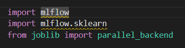   
>      여기서 joblib 모듈은 airflow에서 grid_search를 사용할 때 n_job을 고정시키는데 사용되는 모듈이다.

>    2. MLFlow 서버와 연결   
>      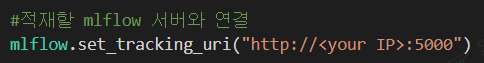

>    3. MLFlow run 시작   
>      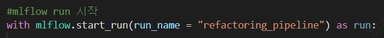   
>      괄호안에 run_name을 통해 이름지정이 가능하다.   

>    4. parameter적재    
>      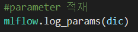   
>      model에서 사용된 parameter를 적재하는 함수 type은 dict이다.

>    5. model score 적재   
>      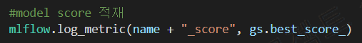

>    6. model 등록   
>      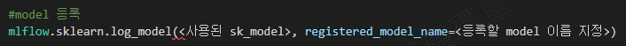

>    완성파일 예시 **[[참조] po_refactoring_pipeline_grid.py](../pipeline/p04_pipelines/refactoring_pythonoperator/po_refactoring_pipeline_grid.py)**  
>    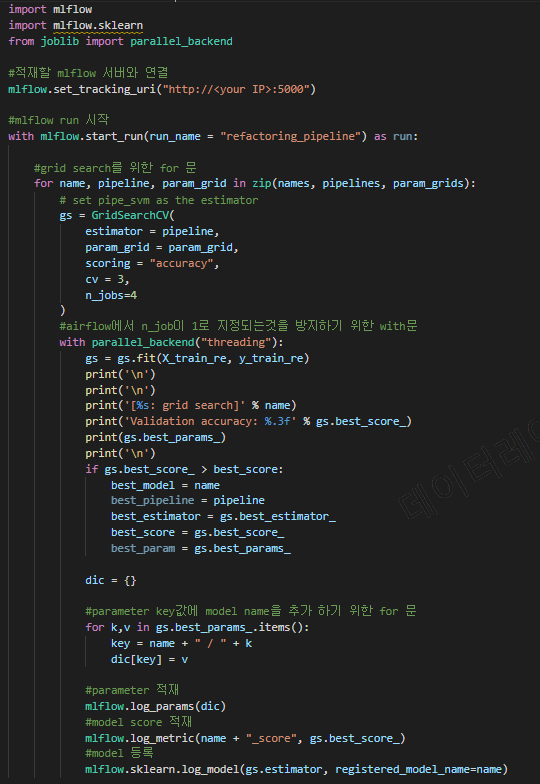  

[MLFlow Doc 참조 링크 : 최신](https://www.mlflow.org/docs/latest/index.html)  
[MLFlow Doc 참조 링크 : 1.7.0 (Airflow내 mlflow 패키지 사용시 참고)](https://www.mlflow.org/docs/1.7.0/index.html)

**<br><span style='color:gray; float: right;'>[TOC ↑](#)</span><br>**

### yaml 파일 작성

    진행 필요

**<br><span style='color:gray; float: right;'>[TOC ↑](#)</span><br>**

### DAG File 샘플 작성 

    1. 필요모듈 import
        코드를 작성하는데 사용되는 패키지를 import한다.
        ex) DAG, PythonOperator, DockerOperator
    
    2. dag 옵션설정
        dag이름, schedule_interval, tags등 
    3. 사용할 Operator로 Task작성 
    4. Task 실행순서 설정

**<br><span style='color:gray; float: right;'>[TOC ↑](#)</span><br>**


### DAG TAG 규칙

> DAG의 TAG는 기본적으로 형식이 주어지지 않았으나 관리의 편리성과 정형화를 위해 규칙을 준수  
> 추후 검색 시에도 TAG를 입력하여 원하는 정보만 골라 볼 수 있다.
>
> ex]  
> > 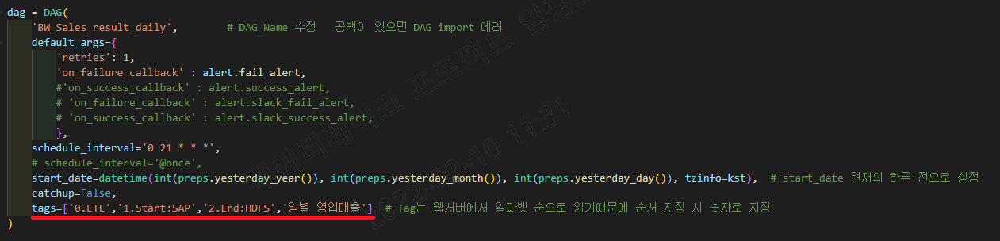
>
> DAG 및 TAG는 Airflow Webserver가 숫자, 알파벳 순으로 읽기 때문에 순서를 지정해줄 때 가장 먼저 보이고 싶다면 숫자를 먼저 입력하면 된다.

    [Example] tags=['0.ETL','1.Start:SAP','2.End:HDFS','일별 영업매출']

    '0.~~~'     # DAG의 Action을 명시 
                 # Ex] 0.ETL | 0. PREP | 0. XFORM 0. MODEL
    
    '1.Start:~~~'     # 파이프라인의 Data Source 명시
                 # Ex] 1.HIVE | 1. SAP | 1. TIBERO
    
    '2.End:~~~'     # 파이프라인의 End Point 명시
                 # Ex] 2.HDFS | 2. SERVER | 2. ~~~
    
    '~~~~'       # 마지막 TAG는 해당 DAG의 정보 입력
                 # Ex] '회전일수' | '영업매출' | '단순 ETL'


    '99. Template'    # Template DAG들만 명시


**<br><span style='color:gray; float: right;'>[TOC ↑](#)</span><br>**

### 현재 완료된 DAG 설명

    01. bw_sales_result_daily               # 일별 영업매출
    02. bw_sales_result_monthly             # 월별 영업매출
    03. credit_limit_history                # 여신한도
    04. customer_master                     # 거래처 마스터
    05. days_split_upload                   # 날짜분할적재
    06. dlp_log                             # DLP ElasticSearch Log
    07. finance_ml_final                    # ML Test
    08. hdfs_split_upload                   # HDFS 분할 적재
    09. hdfs_to_sftp_sample                 # HDFS to SFTP Sample Template
    10. monthly_workday                     # 월별 회전일수
    11. openapi_weather                     # OpenAPI Sample Template(기상청 단기예보 조회서비스 이용)
    12. outstanding_balance_aging           # 미수금 Aging
    13. outstanding_balance_monthly         # 채권
    14. refactoring_211206                  # refactoring_model 211206 Test
    15. refactoring_model_python            # pythonOperator Sample Test
    16. refactoring_tcp_test                # DockerOperator의 docker_url을 사용하여 106번 서버에서의 work Test
    17. sftp_sample                         # SFTP to HDFS Sample Template
    18. workday                             # 영업일수
    19. pythonoper_test                     # 106번 Worker Test


**<br><span style='color:gray; float: right;'>[TOC ↑](#)</span><br>**

---

## Common

> 기본적으로 Airflow의 실행 로그는 남지만 사용자가 따로 Logging을 하려 할 때 쓸 수 있는 모듈의 Directory

**<br><span style='color:gray; float: right;'>[TOC ↑](#)</span><br>**

---

## 빌드

    Gitlab Project에 Push하면 CI/CD 설정을 해놓았기에 이미지 빌드와 소스코드 이동이 자동화되어 있다.

> Local에서 개발 시 DockerOperator사용
> > 1. pipeline_DAG / Dockerfile 작성  
> >   Python 코드를 Docker Image로 만들 Dockerfile작성
> >   Airflow에서 실행시킬 DAG 파일 작성
> >
> > 2. Docker Image 생성   
> >   작성한 Dockerfile 이 있는 폴더로 이동
> > - ex) cd /data/infrastructure/pipeline/p04_pipeline/_dockerfile_path   
> >   폴더로 이동 후 Docker build 명령어로 Docker Image 생성
> > - docker build . -t "pipeline_name"


> Local에서 개발 시 PythonOperator사용
> > 1. pipeline_DAG 작성    
> >   Source Code를 PythonOperator에서 사용할 수 있도록 파트별로 함수로 분리
> >
> > 2. ETL의 경우 주로 Extract, Xform, Load 3단계로 구성   
> >   Extract : DB에서 데이터를 가져오는 단계   
> >   Xform : Extract에서 가져온 데이터를 전처리 하는 단계   
> >   Load : Xform을 거친 데이터를 적재하는 단계   
> > - dataframe형식은 return에 적합하지 않기 때문에 단계별 데이터 전송은 함수의 return이 아닌 pickle형태로 저장 후 불러오는 방식을 사용   

> DockerOperator 및 PythonOperator로 DAG를 만들면 해당 파이프라인 폴더를    
> 서버 Push용 git 원격지로 복사 하여 Push하면 적용 완료 


**<br><span style='color:gray; float: right;'>[TOC ↑](#)</span><br>**

---

## 배포 및 테스트

    gitlab에 push할 경우 Runner를 통해 자동으로 배포가 진행되므로 CentOS 터미널에
    git add .
    git commit -m "comment"
    git push 

>Airflow Webserver 접속 : 10.120.4.109:8081
>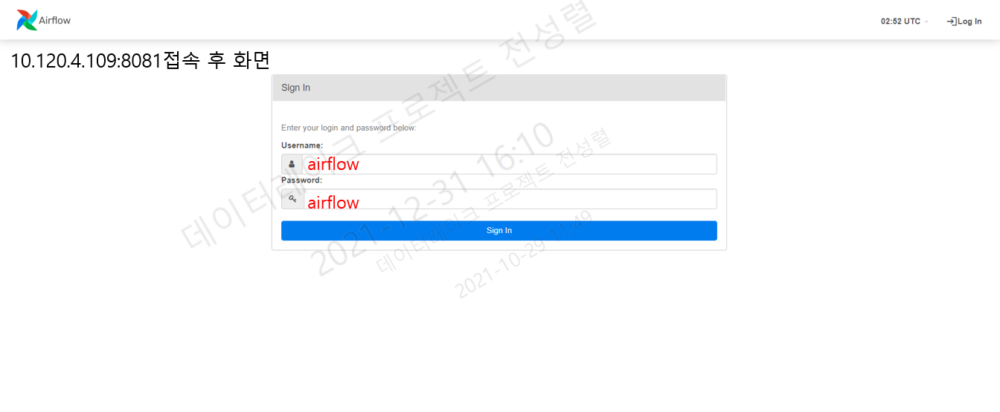

>작성한 DAG 실행 [처음 실행시 스위치로 조작][강제 시작할 경우 Action의 플레이버튼 - trigger DAG]
>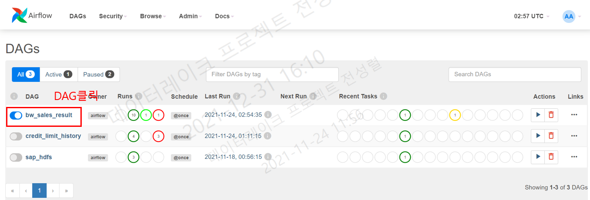
>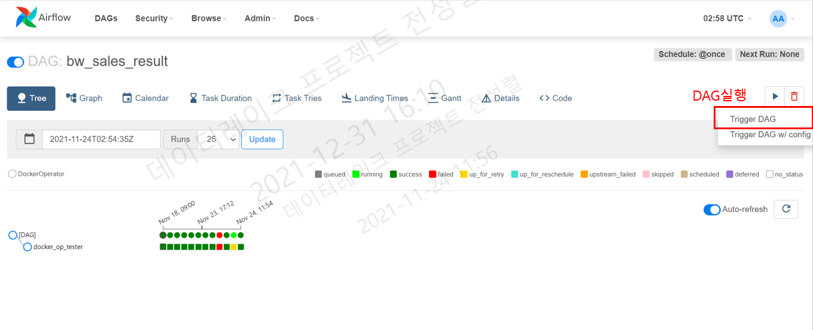

> 로그확인
> 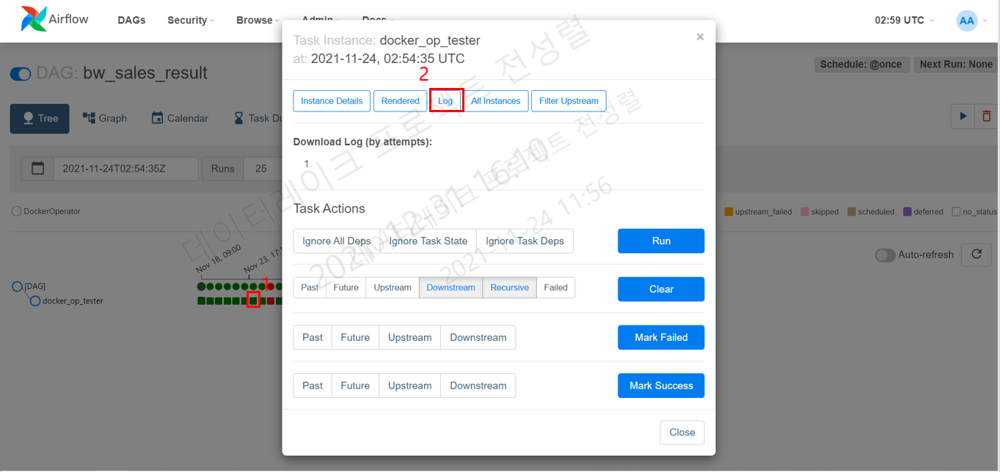


    ps) DAG가 안 보일 경우
    - Airflow가 아직 업로드되지 않았기에 조금 기다리면 나온다(30초마다 DAG스캔하도록 설정함)
    - docker-compose.yaml에서 dag폴더 마운트가 제대로 되어있는지 확인
    - DAG파일에서 dag=dag 설정이 빠져있지 않은지 확인!!


**<br><span style='color:gray; float: right;'>[TOC ↑](#)</span><br>**

---

# 발생 가능 에러

**WSL**
> Dockerfile build 시 발생 에러
> - failed to solve with frontend dockerfile.v0: failed to create LLB definition: failed to authorize: rpc error: code = Unknown desc = failed to fetch anonymous token: Get "https://auth.docker.io/token?scope=repository%3Alibrary%2Fmariadb%3Apull&service=registry.docker.io": x509: certificate signed by unknown authority  
>
> Solution  
> \# In WSL2 Console 명령어 입력
> - export DOCKER_BUILDKIT=0
> - export COMPOSE_DOCKER_CLI_BUILD=0
>
> \# In PowerShell 명령어 입력
> - $Env:DOCKER_BUILDKIT=0
> - $Env:COMPOSE_DOCKER_CLI_BUILD=0
> ---
> Dockerfile build 중 apt update 시 발생 에러
> - packages.microsoft.com/debian/10/prod
        Certificate verification failed : The certificate is NOT trusted.  
>
>Solution  
> 내부 인트라넷 보안 정책으로 인해 결제 필요

**Gitlab CI/CD**
>sudo 사용시 gitlab-runner: command not found에러  
>- sudo를 빼고 진행

>New runner. Has not connected yet에러발생시 
>- WSL 터미널에 gitlab-runner verify 입력
>  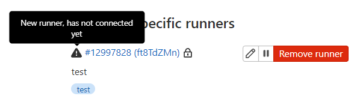

>JOB이 pending상태에서 멈춰있는 경우  
>- WSL 터미널에 gitlab-runner run 입력 
>
>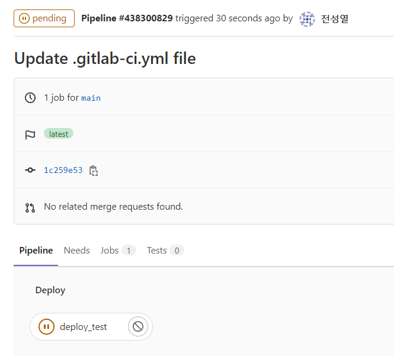

**Local Airflow Test** 
>Hadoop Connection Error
> - socket.gaierror: [Errno -5] No address associated with hostname
> - [Errno -3] Temporary failure in name resolution
> - [Errno -2] Name or service not known 
>
>Solution  
> \# In WSL Console 명령어
> cat /etc/resolv.conf 
> - search lottechilsung.co.kr      \# DNS 설정이 되어 있는지 확인  
>
> DNS 설정이 되어 있지 않다면 vi / vim을 통해 resolv.conf에 내용 추가
> vi /etc/resolv.conf
>
> ps) WSL은 재부팅시 설정이 초기화 되기 때문에 Test시 다시 적용해주어야 합니다.
>
>---
>docker.sock Error  
> 사용중인 도커의 기능을 빌려서 이용하는 DooD(Docker out of Docker) 방식을 통해서 DockerOperator를 사용하기 위해 docker.sock의 Permission 변경 필요  
>\# In WSL Console 명령어
> - (sudo) chmod 666(or 777) /var/run/docker.sock
>
> 참고: [DinD / DooD](https://m.blog.naver.com/PostView.naver?isHttpsRedirect=true&blogId=isc0304&logNo=222274955992)
>
>---
>
> docker-compose up 진행 시 오류
> - permission denied: /opt/airflow/logs/scheduler   
>
>Solution
>
> 마운트 시킬 logs폴더의 권한에 write가 없어 발생한 에러!
> 마운트 시킬 logs 폴더에 w 권한 부여  
> \# In WSL Console 명령어  
> (sudo) chmod +w <마운트/시킬/폴더>  
>
>---
>
> 

**Compose up 진행시**
> PermissionError: [Errno 13] Permission denied: '/opt/airflow/logs/scheduler'
>
> logs 폴더 관련 에러 발생 시
> logs 폴더 내 폴더 및 파일 삭제 후 진행!
> 폴더 및 파일 삭제 후 동일 에러 발생 시 logs 폴더 퍼미션 777 부여
> - chmod 777 /path/to/logs
>
> ---
> GCC / SASL Error  
>
> 이미지 빌드 시 gcc / sasl error   
> apt-get install 을 통해 gcc / sasl의 필요 라이브러리 설치 필요   
> - RUN apt-get -y install gcc g++  
>   RUN apt-get install -y python3-dev libpq-dev  
>   RUN apt-get install -y libsasl2-dev libsasl2-2 libsasl2-modules-gssapi-mit libevent-dev  
>   RUN apt-get install -y openjdk-11-jdk

**Broken Pipe**
> Airflow에 DAG 등록 후 DAG Import Error 내용 : Broken pipe 발생 시  
> Broken pipe의 대부분의 문제는 소스코드의 에러이므로 소스코드 수정 필요!

**MLFlow**
> pythonoperator를 통해 mlflow 진행 시   
> AttributeError: module 'mlflow' has no attribute 'sklearn' 에러 발생의 경우  
> import mlflow가 되어있어도 mlflow내의 모듈을 못읽는 문제로 예상되어 import mlflow.sklearn을 추가해주면 진행 가능

**JupyterHub**
> File Load Error for Unhandled error
> 공유폴더 사용 시 해당 파일 경로에 .ipynb_checkpoints 폴더의 권한이 기본적으로 655로 되어 있어 다른 사용자가 수정하지 못해서 발생하는 에러!
> 해당 경로에서 ipynb나 다른 파일을 수정할 시 생기는 .ipynb_checkpoints 폴더이기에 기본 소유자가 처음 사용자로 되어있어 Read는 되어도 Write 권한을 사용하려 하면 에러 발생
> 터미널에서 해당 파일 경로로 이동 후 .ipynb_checkpoints 폴더의 권한을 변경해줘야 함
>
> chmod 777 or chmod 775 .ipynb_checkpoints
> 명령어 실행

**System**
> **Docker**
>
> docker 상태 확인
> $docker ps    # 현재 실행중인 도커 컨테이너 확인
> $docker container ls -a      # 생성되어 있는 컨테이너 전체 확인
>
> container가 stop되어있는 경우
> docker start <container name>

**<br><span style='color:gray; float: right;'>[TOC ↑](#)</span><br>**

---
